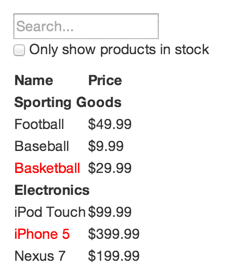

## 文档
<https://reactjs.org/docs/thinking-in-react.html>

## Thinking in React

React is, in our opinion, the premier way to build big, fast Web apps with JavaScript. It has scaled very well for us at Facebook and Instagram.

在我们看来，React是用JavaScript构建大型、快速的Web应用程序的首要方式。 它在Facebook和Instagram上为我们提供了很好的扩展。

One of the many great parts of React is how it makes you think about apps as you build them. In this document, we’ll walk you through the thought process of building a searchable product data table using React.

React的众多好处之一就是它如何让你在构建应用程序的时候思考它们。在本文中，我们将引导您在用React构建可搜索产品数据表时的思考过程。

### Start With A Mock 
Imagine that we already have a JSON API and a mock from our designer. The mock looks like this:

假设我们已经有了一个JSON API和一个模型。模型来自设计师，长这样：



Our JSON API returns some data that looks like this:

```
[
  {category: "Sporting Goods", price: "$49.99", stocked: true, name: "Football"},
  {category: "Sporting Goods", price: "$9.99", stocked: true, name: "Baseball"},
  {category: "Sporting Goods", price: "$29.99", stocked: false, name: "Basketball"},
  {category: "Electronics", price: "$99.99", stocked: true, name: "iPod Touch"},
  {category: "Electronics", price: "$399.99", stocked: false, name: "iPhone 5"},
  {category: "Electronics", price: "$199.99", stocked: true, name: "Nexus 7"}
];
```

### Step 1: Break The UI Into A Component Hierarchy 第一步：将UI打碎成Component层级

The first thing you’ll want to do is to draw boxes around every component (and subcomponent) in the mock and give them all names. If you’re working with a designer, they may have already done this, so go talk to them! Their Photoshop layer names may end up being the names of your React components!

你要做的第一件事就是在模型中的每个组件（和子组件）周围画框，并给它们全都命名。 如果你正在和一个设计师合作，那么他们可能已经做了这个工作，所以去和他们谈谈！ 他们的Photoshop图层名称可能最终会成为您的React组件名称！

But how do you know what should be its own component? Just use the same techniques for deciding if you should create a new function or object. One such technique is the single responsibility principle, that is, a component should ideally only do one thing. If it ends up growing, it should be decomposed into smaller subcomponents.

但你怎么知道哪些需要单独作为一个组件？只需使用相同的技巧来决定是否应该创建一个新的函数或对象。 一种技巧就是单一责任原则（single responsibility principle），就是说，一个组件应该只做一件事。 如果结果导致了（代码量）增长，则应该分解成更小的子组件。

Since you’re often displaying a JSON data model to a user, you’ll find that if your model was built correctly, your UI (and therefore your component structure) will map nicely. That’s because UI and data models tend to adhere to the same information architecture, which means the work of separating your UI into components is often trivial. Just break it up into components that represent exactly one piece of your data model.

由于您经常向用户展示JSON data model，您会发现如果您的model构建恰当，那么您的UI（以及您的组件结构）将会很好地映射。 这是因为UI和data models倾向于遵循相同的信息架构，这意味着将UI分解为组件的工作通常是琐碎的。 应该把UI分解成能完全代表你的data model的一部分的组件。


You’ll see here that we have five components in our simple app. We’ve italicized the data each component represents.

你在这里看到，在我们简单的应用程序中有5个组件：

1. FilterableProductTable (orange): contains the entirety of the example
1. 容器组件（橙色）

2. SearchBar (blue): receives all user input
2. 搜索栏（蓝色）

3. ProductTable (green): displays and filters the data collection based on user input
3. 产品表（绿色）：根据用户的input展示和过滤数据集

4. ProductCategoryRow (turquoise): displays a heading for each category
4. 产品类别行（蓝绿色）：展示每个类别的标题

5. ProductRow (red): displays a row for each product
5. 产品行（红色）：每个产品显示一行

If you look at ProductTable, you’ll see that the table header (containing the “Name” and “Price” labels) isn’t its own component. This is a matter of preference, and there’s an argument to be made either way. For this example, we left it as part of ProductTable because it is part of rendering the data collection which is ProductTable’s responsibility. However, if this header grows to be complex (i.e. if we were to add affordances for sorting), it would certainly make sense to make this its own ProductTableHeader component.

如果你查看ProductTable，你将看到表头（包含"Name"和"Price"）自己并不是一个组件。这是一个偏好的问题，有些观点认为应该使用另外一种方式创建。在本例中，我们把它作为ProductTable组件的一部分，因为表头也是渲染数据集的一部分，而这也是ProductTable的责任。但是，如果表头变得非常复杂(比如，如果我们要为分类添加可能性)，那么将其设置为ProductTableHeader组件肯定是有意义的。

Now that we’ve identified the components in our mock, let’s arrange them into a hierarchy. This is easy. Components that appear within another component in the mock should appear as a child in the hierarchy:

现在我们已经确定了模型中的组件，让我们把它们安排到一个层次结构中。这很容易。模型中，出现在另一个组件中的组件应该在层次结构中作为一个子组件。

- FilterableProductTable
  - SearchBar
  - ProductTable
    - ProductCategoryRow
    - ProductRow

### Step 2: Build A Static Version in React 用React创建一个静态版本
