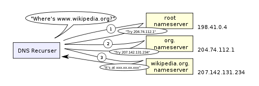

<http://igoro.com/archive/what-really-happens-when-you-navigate-to-a-url/>

## What really happens when you navigate to a URL

As a software developer, you certainly have a high-level picture of how web apps work and what kinds of technologies are involved: the browser, HTTP, HTML, web server, request handlers, and so on.

作为一个软件开发工程师，你当然对web应用程序是是怎样工作的以及涉及到的技术——浏览器、HTTP、HTML、web服务器、请求处理等有这高层次的理解。

In this article, we will take a deeper look at the sequence of events that take place when you visit a URL.

在本文中，我们将深入地回顾一下当你访问一个URL时发生的事件序列。

### 1. You enter a URL into the browser: 在浏览器上输入一个URL
例如https://www.facebook.com/

### 2. The browser looks up the IP address for the domain name:浏览器查找域名的IP地址

The first step in the navigation is to figure out the IP address for the visited domain. The DNS lookup proceeds as follows:

导航的第一步是找出被访问域名的IP地址。DNS按以下顺序查找：

#### （1）Browser cache： 浏览器缓存
 The browser caches DNS records for some time. Interestingly, the OS does not tell the browser the time-to-live for each DNS record, and so the browser caches them for a fixed duration (varies between browsers, 2 – 30 minutes).

 浏览器会将DNS记录缓存一段时间。有趣的是，操作系统并没有告诉浏览器每个DNS记录的山村时间，一次浏览器会将它们缓存一段固定的时间（根据浏览器的不同而不同，2-30分钟）

 #### （2）OS cache:操作系统缓存
 If the browser cache does not contain the desired record, the browser makes a system call (gethostbyname in Windows). The OS has its own cache.

 如果浏览器缓存中不包含所需的记录，则浏览器会进行系统调用（Windows中为gethostbyname）。操作系统有它自己的缓存。

 #### （3）Router cache:路由器缓存
 The request continues on to your router, which typically has its own DNS cache。

 查找继续进行到你的路由器，路由器通常有它自己的DNS缓存。

 #### （4）ISP DNS cache:ISP的DNS缓存

 The next place checked is the cache ISP’s DNS server. With a cache, naturally.

 下一个需要检查的是ISP(互联网服务提供商)的DNS服务器的缓存。

 #### （5）Recursive search:递归搜索
 Your ISP’s DNS server begins a recursive search, from the root nameserver, through the .com top-level nameserver, to Facebook’s nameserver. Normally, the DNS server will have names of the .com nameservers in cache, and so a hit to the root nameserver will not be necessary.

你的ISP的DNS服务器开始进行递归搜索，从根域名服务器开始，经过.com顶级域名服务器，到Facebooke的域名服务器。通常，DNS服务器的缓存中含有.com的域名服务器的名称，所以命名根域名服务器不是必需的。

Here is a diagram of what a recursive DNS search looks like:

***NOTE:***

One worrying thing about DNS is that the entire domain like wikipedia.org or facebook.com seems to map to a single IP address. Fortunately, there are ways of mitigating the bottleneck:

关于DNS的一个令人担心的问题是整个域（例如wikipedia.org或facebook.com）似乎映射到了一个单一的IP地址。幸运的是，有好几种方法可以缓解这一瓶颈：

- **Round-robin DNS** is a solution where the DNS lookup returns multiple IP addresses, rather than just one. For example, facebook.com actually maps to four IP addresses.

- **循环DNS** 是DNS查询返回多个IP地址、而非仅仅返回一个IP地址的解决方案。比如，facebook.com实际上会映射4种IP地址。

- **Load-balancer** is the piece of hardware that listens on a particular IP address and forwards the requests to other servers. Major sites will typically use expensive high-performance load balancers.

- **负载平衡器**是监听特定IP地址并将请求转发给其他服务器的硬件。主要的网站都通常会使用

- **Geographic DNS** improves scalability by mapping a domain name to different IP addresses, depending on the client’s geographic location. This is great for hosting static content so that different servers don’t have to update shared state.
- **Anycast** is a routing technique where a single IP address maps to multiple physical servers. Unfortunately, anycast does not fit well with TCP and is rarely used in that scenario.

***注意：***

- **Round-robin DNS:** 循环DNS