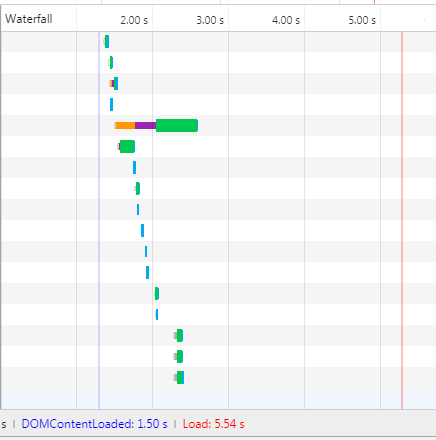

## 一、DOMContentLoaded 与 load事件
关于load和DOMContentLoaded事件，mdn对于它们是这样描述的：

### DOMContentLoaded
mdn文档地址:<https://developer.mozilla.org/zh-CN/docs/Web/Events/DOMContentLoaded>

The DOMContentLoaded event is fired when the initial HTML document has been completely loaded and parsed, without waiting for stylesheets, images, and subframes to finish loading.

意思就是：当初始的 HTML 文档被完全加载和解析完成之后，DOMContentLoaded 事件被触发，而无需等待样式表、图像和子框架的完成加载。

### load
mdn文档地址:<https://developer.mozilla.org/zh-CN/docs/Web/Events/load>

The load event is fired when a resource and its dependent resources have finished loading.

意思就是：当一个资源及其依赖资源已完成加载时，将触发load事件。

### 区别小结
简而言之，二者触发时间的区别在于：DOMContentLoaded在HTML文档被解析完成之后触发，而load是在HTML所有相关资源被加载完成后触发。

为了感受这两个事件，可以使用Chrome打开一个任意一个网页。打开控制台的Network面板。以下是[FT中文网首页](http://www.ftchinese.com)的Network面板Waterfall截图：

可以看到图上有两条线：一条蓝线，代表DOMContentLoaded事件，触发时间为1.50s;一条红线，代表load事件，触发时间为5.54s。

如果想要更直观地感受二者的区别，还可以点击这个页面：<https://testdrive-archive.azurewebsites.net/HTML5/DOMContentLoaded/Default.html>

## 二、HTML解析过程与DOMContentLoaded触发时机
我们已经知道DOMContentLoaded的触发时间为：当 HTML文档被加载和解析完成。那么我们还需要理解HTML的解析过程。

此处我们先只考虑同步js的情况。

### 1.在既没有CSS也没有JS的情况下，HTML文档的解析过程为：

DOMContentLoaded事件的触发时机为:HTML解析为DOM树之后。

### 2.有CSS无JS的情况下，HTML文档解析过程为：

这里与1.不同的地方在于，渲染树的生成是基于DOM和CSSOM的。但是触发DOMContentLoaded的时间依然是在HTML解析为DOM后，无论此时CSS解析为CSSOM的过程是否完成。

### 3.当有JS时，HTML文档解析过程为：

> 注意：DOMContentLoaded 事件必须等待其所属script之前的样式表加载解析完成才会触发。

> 注意: 同步 JavaScript 会暂停 DOM 的解析。所以只有同步JavaScript执行完之后才会继续解析DOM。

###  有一个问题：关于首屏时间？
“计算这个网页从空白到出现内容所花费的时间”。那怎么计算这段时间？这段时间其实就是HTML 文档加载和解析的时间。也就是DOMContentLoaded 事件触发之前所经历的时间。

***所以，对于首屏时间而言，js放在HTML文档的开头和结尾处效果是一样的***。而js放在结尾的目的并不是为了减少首屏时间，而是由于js经常需要操纵DOM，放在后面才更能保证找到DOM节点。 

***而要想首屏渲染的快，就不应该在首屏加载js文件***。可以将js异步化。

## 三、异步脚本、延迟脚本与DOMContentLoaded的关系
### sync
为了与异步脚本和延迟脚本进行一个更清晰的对比，在这里先将同步脚本的情况分析一下。

如上图所示， HTML 文档被解析时如果遇见（同步）脚本，则停止解析，先去加载脚本，然后执行，执行结束后继续解析 HTML 文档。HTML文档解析完毕后触发DOMContentLoaded。

### async 
对此，《JavaScript高级程序设计》一书的解释是：带async的脚本一定会在load事件之前执行，可能会在DOMContentLoaded之前或之后执行。

为什么async脚本可能会在DOMContentLoaded之前或之后执行呢？或者说，为什么DOMContentLoaded事件的触发既可能在async脚本执行前、又可能在async脚本执行后呢？ 这是因为，async 标签的脚本加载完毕的时间有两种情况：

情况1： HTML 还没有被解析完的时候，async脚本已经加载完了，那么 HTML 停止解析，去执行脚本，脚本执行完毕后继续解析HTML, HTML解析完触发DOMContentLoaded事件。此时DOMContentLoaded事件在async脚本执行之后触发。如下图所示：

情况2： HTML 解析完了之后，async脚本才加载完，然后再执行脚本，那么在HTML解析完毕、async脚本还没加载完的时候就触发DOMContentLoaded事件。如下图所示：

总之， **DomContentLoaded 事件只关注 HTML 是否被解析完，而不关注 async 脚本**。

### defer

如果 script 标签中包含 defer，那么这一块脚本将不会影响 HTML 文档的解析，而是等到 HTML 解析完成后才会执行。而 DOMContentLoaded 只有在 defer 脚本执行结束后才会被触发。

defer脚本同样包含两种情况：

情况1：HTML还没解析完成时，defer脚本已经加载完毕，那么defer脚本将等待HTML解析完成后再执行。defer脚本执行完毕后触发DOMContentLoaded事件。如下图所示

情况2：HTML解析完成时，defer脚本还没加载完毕，那么defer脚本继续加载，加载完成后直接执行，执行完毕后触发DOMContentLoaded事件。如下图所示：

***注意defer情况2与async情况2的两个图非常相似，区别就在于DOMContentLoaded事件的触发时间点。***

对于defer脚本，《JavaScript高级程序设计》一书的说法是:“按照h5规范，两个defer脚本会安装它们出现的先后顺序执行，两个脚本会在DOMContentLoaded之前执行。”这和我们上面的分析一致。然而，该书接下来说，“但事实上，defer脚本不一定会按顺序执行，也不一定会在DOMContentLoaded之前执行。”***这是一个待再继续研究测试的问题***

## 参考博客

Using setTimeout to speed up window.onload: <https://mathiasbynens.be/notes/settimeout-onload>

<http://www.cnblogs.com/coco1s/p/4010310.html>

你不知道的DOMContentLoaded:<https://zhuanlan.zhihu.com/p/25876048>

<https://www.cnblogs.com/lhb25/p/how-browsers-work.html>
原文:<https://www.html5rocks.com/zh/tutorials/internals/howbrowserswork/>