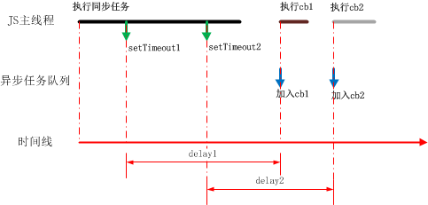
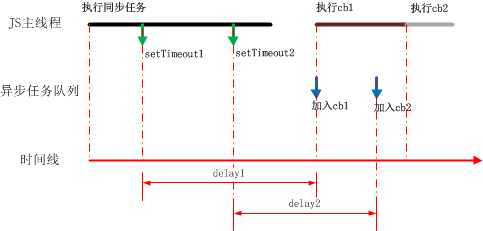
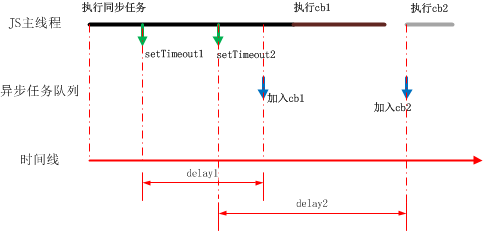
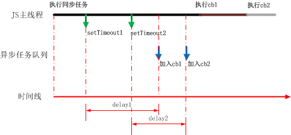
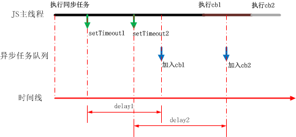
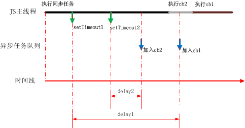

前段时间，老板交给了我一个任务：通过setTimeout来延后网站某些复杂资源的请求。正好借此机会，将JavaScript运行机制和setTimeout重新认真思考一遍，并将我对它们的理解整理如下。

## 1.JavaScript运行机制
### 核心特征：单线程
JavaScript在浏览器中是**单线程**运行的。所谓**单线程**，就是同一时刻只执行一个任务，简单来讲，就是任何时刻JS主线程都只有一句JavaScript代码在运行。

那么为什么JavaScript一定要是单线程呢？如果同时有多个线程运行岂不更强大吗？关于这个问题，在[JavaScript运行机制详解](http://www.ruanyifeng.com/blog/2014/10/event-loop.html)一文中有给出一个通俗易懂的解释：“假定JavaScript同时有两个线程，一个线程在某个DOM节点上添加内容，另一个线程删除了这个节点，这时浏览器应该以哪个线程为准？” 所以，**与用户交互和操作DOM这些主要用途，这决定了JavaScript必须是单线程的**。

### 任务队列
虽然JavaScript每个时刻只能做一个任务，但它并不是只有一个任务需要做。比如它有Ajax回调函数需要执行，它有用于监听click事件的监听函数需要执行，它有setTimeout的函数需要执行...这些在某个时机需要执行的东西，都是JavaScript需要完成的任务；JavaScript主线程当前正在执行的东西，也是它需要完成的一个任务。面对这么多任务，JavaScript一次又只能处理一个任务，用于管理任务执行的**任务队列**就应运而生了。

所有这些任务中首要的当然是那些被主线程顺序执行的一行一行的代码，即**同步任务**。主线程在执行同步任务的过程中，可能会接到未来需要执行某个其他任务的指示。那些未来需要执行的任务，即为**异步任务**。主线程由于手中还没忙完**同步任务**，就只能先把接到的**异步任务**的指示记录下来。

如何记录呢？那就是在合适的时候把相关异步任务推到任务队列中。这里有两点需要理解清楚。第一，并不是马上就把异步任务推到任务队列中，而是在恰当的时机再把异步任务推到队列中，这个时机比如Ajax请求成功返回的时候、click事件触发的时候、setTimeout设置的时间点到了的时候。第二，推到任务队列这个“推到”的动作并不意味着“马上执行”，它只是告诉主线程有这个任务在这里需要被执行，如果主线程有空就赶紧执行，如果主线程现在没有空，那么一旦有空就要考虑执行。

那么对于这个需要执行的任务而言，主线程什么时候才能称得上是有空了呢？第一，主线程已经执行完了同步任务；第二，主线程已经把异步队列中排在该任务之前的任务都执行完了。这时，主线程就可以放心大胆地执行该任务了。当然，该**异步任务**一旦被执行，对于主线程而言也就不再是**异步**而是**同步**的了。

### 一次正确的Event Loop执行顺序:
其实上述任务队列中的任务叫做宏任务(macrotask),又叫task。同步代码也是一种宏任务。

除了宏任务之外，还有一种微任务(microtask),又叫job。

- 宏任务包括:script(包括同步js代码)、setTimeout、 setInternal、setImmeidate(非标准)、I/O、UI rendering
- 微任务包括: promise等

一次正确的Event Loop执行顺序:

- (1)执行同步代码，这属于宏任务
- (2)执行栈为空（由执行环境，也叫执行上下文组成的），查询是否有微任务需要执行
- (3)执行所有微任务
- (4)必要的话渲染UI
- (5)开始下一轮Event Loop，执行下一个宏任务（task队列里的下一段异步代码）

## 2. setTimeout
在理解了JavaScript运行机制后，理解setTimeout就很容易了。

JavaScript主线程在遇到代码setTimeout(cb, n)时，要做的事情为：**在延迟指定时间n后，将setTimeout回调函数cb加入任务队列中**。

注意，经过时间n后，cb只是**被加入**任务队列中，而非被执行。

结合setTimeout，我们可以更清晰地理解JavaScript运行机制：

假设JavaScript主线程会先后遇到两句setTimeout代码，分别记为代码片setTimeout1和setTimeout2,其回调函数分别为cb1和cb2，延迟时间分别为delay1和delay2。则可以得到如所示的JavaScript任务执行情况图：

> **注意**:HTML5规定setTimeout()的最短时间间隔是**4ms**
### 情况1：两个异步任务都在同步任务结束一段时间后才加入异步队列，且后一个异步任务加入时前一个异步任务已执行结束

这种情况最清晰明朗，几个任务互相没有干扰，就是说没有出现某个任务需要等待另一个任务执行结束才能执行的情况。

### 情况2：两个异步任务都在同步任务结束一段时间后才加入异步队列，但前一个异步任务的执行推迟了后一个异步任务的执行

在该情况下，cb2加入到异步任务队列的时候并不能马上执行，因为JS主线程还在执行cb1。待cb1执行结束后，cb2开始执行。

### 情况3：在同步任务还未执行结束时，已经有异步任务加入异步队列

如图所示，在同步任务还未执行完时，setTimeout1指定的delay1已经到时间了，将cb1加入异步任务队列。此时因为同步任务还未结束，所以cb1的执行会推迟到同步任务执行结束。

为了逐步增加所述情况的复杂程度，这里暂时将cb2加入异步队列的时间假定为在同步任务和cb1都已经执行完之后。

### 更复杂的情况
基于以上3种情况，不难得出更复杂的几种情况：

多个异步任务都是在同步任务还未执行结束时就已经加入异步队列：

有异步任务在同步任务还未结束时加入异步队列，也有异步任务在前一个异步任务还未结束时加入异步队列：

当然，还有情况是，后一个任务的加入时间早于前一个任务（比如delay1远大于delay2）：

## 参考资料
setTimeout的那些事：
<http://imweb.io/topic/56ac67fbe39ca21162ae6c78>

JavaScript运行机制详解：
<http://www.ruanyifeng.com/blog/2014/10/event-loop.html>

INTERVIEW-MAP:2018年08月刊