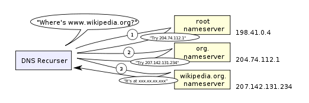

<http://igoro.com/archive/what-really-happens-when-you-navigate-to-a-url/>

## What really happens when you navigate to a URL

As a software developer, you certainly have a high-level picture of how web apps work and what kinds of technologies are involved: the browser, HTTP, HTML, web server, request handlers, and so on.

作为一个软件开发工程师，你当然对web应用程序是是怎样工作的以及涉及到的技术——浏览器、HTTP、HTML、web服务器、请求处理等有这高层次的理解。

In this article, we will take a deeper look at the sequence of events that take place when you visit a URL.

在本文中，我们将深入地回顾一下当你访问一个URL时发生的事件序列。


### 1. You enter a URL into the browser: 在浏览器上输入一个URL
例如https://www.facebook.com/

### 2. The browser looks up the IP address for the domain name:浏览器查找域名的IP地址

The first step in the navigation is to figure out the IP address for the visited domain. The DNS lookup proceeds as follows:

导航的第一步是找出被访问域名的IP地址。DNS按以下顺序查找：

#### （1）Browser cache： 浏览器缓存
 The browser caches DNS records for some time. Interestingly, the OS does not tell the browser the time-to-live for each DNS record, and so the browser caches them for a fixed duration (varies between browsers, 2 – 30 minutes).

 浏览器会将DNS记录缓存一段时间。有趣的是，操作系统并没有告诉浏览器每个DNS记录的生存时间，一次浏览器会将它们缓存一段固定的时间（根据浏览器的不同而不同，2-30分钟）

 #### （2）OS cache:操作系统缓存
 If the browser cache does not contain the desired record, the browser makes a system call (gethostbyname in Windows). The OS has its own cache.

 如果浏览器缓存中不包含所需的记录，则浏览器会进行系统调用（Windows中为gethostbyname）。操作系统有它自己的缓存。

 #### （3）Router cache:路由器缓存
 The request continues on to your router, which typically has its own DNS cache。

 查找继续进行到你的路由器，路由器通常有它自己的DNS缓存。

 #### （4）ISP DNS cache:ISP的DNS缓存

 The next place checked is the cache ISP’s DNS server. With a cache, naturally.

 下一个需要检查的是ISP(互联网服务提供商)的DNS服务器的缓存。

 #### （5）Recursive search:递归搜索
 Your ISP’s DNS server begins a recursive search, from the root nameserver, through the .com top-level nameserver, to Facebook’s nameserver. Normally, the DNS server will have names of the .com nameservers in cache, and so a hit to the root nameserver will not be necessary.

你的ISP的DNS服务器开始进行递归搜索，从根域名服务器开始，经过.com顶级域名服务器，到Facebook的域名服务器。通常，DNS服务器的缓存中含有.com的域名服务器的名称，所以命名根域名服务器不是必需的。

Here is a diagram of what a recursive DNS search looks like:




***NOTE:***

One worrying thing about DNS is that the entire domain like wikipedia.org or facebook.com seems to map to a single IP address. Fortunately, there are ways of mitigating the bottleneck:

关于DNS的一个令人担心的问题是整个域（例如wikipedia.org或facebook.com）似乎映射到了一个单一的IP地址。幸运的是，有好几种方法可以缓解这一瓶颈：

- **Round-robin DNS** is a solution where the DNS lookup returns multiple IP addresses, rather than just one. For example, facebook.com actually maps to four IP addresses.

- **循环DNS** 是DNS查询返回多个IP地址、而非仅仅返回一个IP地址的解决方案。比如，facebook.com实际上会映射4种IP地址。

- **Load-balancer** is the piece of hardware that listens on a particular IP address and forwards the requests to other servers. Major sites will typically use expensive high-performance load balancers.

- **负载平衡器**是监听特定IP地址并将请求转发给其他服务器的硬件。主要的网站都通常会使用


- **Geographic DNS** improves scalability by mapping a domain name to different IP addresses, depending on the client’s geographic location. This is great for hosting static content so that different servers don’t have to update shared state.

- **地理DNS** 根据客户的地理位置将域名映射到不同的IP地址，从而提高了可伸缩性。这非常适合托管静态内容，以便不同的服务器不必更新共享状态。

- **Anycast** is a routing technique where a single IP address maps to multiple physical servers. Unfortunately, anycast does not fit well with TCP and is rarely used in that scenario.

- **Anycast** 是一种路由技术，它使一个IP地址映射到多个物理服务器。不幸的是，Anycast不适合TCP，而且这种方案是很少被使用的。

Most of the DNS servers themselves use anycast to achieve high availability and low latency of the DNS lookups.

大多数DNS服务器本身使用Anycast来实现DNS查找的高可用性和低延迟行

### 3. The browser sends a HTTP request to the web server:浏览器向web服务器发送应该HTTP请求
You can be pretty sure that Facebook’s homepage will not be served from the browser cache because dynamic pages expire either very quickly or immediately (expiry date set to past).

你应该可以确定的是：Facebook的主页不会从浏览器缓存中获取，因为动态页面很快或者立刻就会过期（通过将有效期设置为一个过去的时间）

So, the browser will send this request to the Facebook server:

所以，浏览器将会发送以下请求到服务器：

```
GET http://facebook.com/ HTTP/1.1
Accept: application/x-ms-application, image/jpeg, application/xaml+xml, [...]
User-Agent: Mozilla/4.0 (compatible; MSIE 8.0; Windows NT 6.1; WOW64; [...]
Accept-Encoding: gzip, deflate
Connection: Keep-Alive
Host: facebook.com
Cookie: datr=1265876274-[...]; locale=en_US; lsd=WW[...]; c_user=2101[...]
```

The GET request names the URL to fetch: “http://facebook.com”. The browser identifies itself (User-Agent header), and states what types of responses it will accept (Accept and Accept-Encoding headers). The Connection header asks the server to keep the TCP connection open for further requests.

以GET请求来命令这个URL获取“http://facebook.com/”。浏览器标识自己（User-Agent头），并指出它将接受什么类型的响应（Accept和Accept-Encoding头）。Connection头告诉服务器保持TCP连接打开，以进行进一步的请求。

The request also contains the cookies that the browser has for this domain. As you probably already know, cookies are key-value pairs that track the state of a web site in between different page requests. And so the cookies store the name of the logged-in user, a secret number that was assigned to the user by the server, some of user’s settings, etc. The cookies will be stored in a text file on the client, and sent to the server with every request.

该请求还包含浏览器针对该域的cookie。正如你可能已经知道的那样，Cookie是键值对，可以在不同的页面请求之间跟踪网站的状态。cookie会存储用户登录名、由服务器分配的用户密码、一些用户设置信息等等。这些cookies会被存储在客户端的文本文件中，并随着每次请求发送到服务器。

Some tips:

***Tip1:*** There is a variety of tools that let you view the raw HTTP requests and corresponding responses. My favorite tool for viewing the raw HTTP traffic is fiddler, but there are many other tools (e.g., FireBug) These tools are a great help when optimizing a site.

***Tip1:***有各种工具可以让你查看原始的HTTP请求和相应的响应。我最喜欢查看原始HTTP流量的工具是fiddler，但还有很多其他工具（例如FireBug）。这些工具在优化网站时非常有帮助。

***Tip2:***In addition to GET requests, another type of requests that you may be familiar with is a POST request, typically used to submit forms. A GET request sends its parameters via the URL (e.g.: http://robozzle.com/puzzle.aspx?id=85). A POST request sends its parameters in the request body, just under the headers.

***Tip2:***除了GET请求之外，您可能熟悉的另一种类型的请求是POST请求，通常用于提交表单。 GET请求通过URL发送其参数（例如：http：//robozzle.com/puzzle.aspx？id = 85）。一个POST请求在请求的body中发送它的参数，其就在请求头下面。

***Tip3：***The trailing slash in the URL “http://facebook.com/” is important. In this case, the browser can safely add the slash. For URLs of the form http://example.com/folderOrFile, the browser cannot automatically add a slash, because it is not clear whether folderOrFile is a folder or a file. In such cases, the browser will visit the URL without the slash, and the server will respond with a redirect, resulting in an unnecessary roundtrip.

URLhttp://facebook.com/ 中的斜杠很重要。在这种情况下，浏览器可以安全地添加斜杠。对于http://example.com/folderOrFile 形式的URL，浏览器不能自动添加斜杠，因为不清楚folderOrFile是文件夹还是文件。在这种情况下，浏览器将访问URL而不使用斜杠，服务器将响应重定向，这会导致不必要的往返。


### 4. The facebook server responds with a permanent redirect:服务器响应一个永久重定向
This is the response that the Facebook server sent back to the browser request:

```
HTTP/1.1 301 Moved Permanently
Cache-Control: private, no-store, no-cache, must-revalidate, post-check=0,
      pre-check=0
Expires: Sat, 01 Jan 2000 00:00:00 GMT
Location: http://www.facebook.com/
P3P: CP="DSP LAW"
Pragma: no-cache
Set-Cookie: made_write_conn=deleted; expires=Thu, 12-Feb-2009 05:09:50 GMT;
      path=/; domain=.facebook.com; httponly
Content-Type: text/html; charset=utf-8
X-Cnection: close
Date: Fri, 12 Feb 2010 05:09:51 GMT
Content-Length: 0
```

The server responded with a 301 Moved Permanently response to tell the browser to go to “http://www.facebook.com/” instead of “http://facebook.com/”.


服务器以301 永久重定向响应，告诉浏览器去访问http://www.facebook.com/ 而不是http://facebook.com/ 。

***Tips***: 

> There are interesting reasons why the server insists on the redirect instead of immediately responding with the web page that the user wants to see.

> 关于为什么服务器坚持重定向而不是立即响应用户希望看到的页面，有一些有趣的原因。

> One reason has to do with search engine rankings. See, if there are two URLs for the same page, say http://www.igoro.com/ and http://igoro.com/, search engine may consider them to be two different sites, each with fewer incoming links and thus a lower ranking. Search engines understand permanent redirects (301), and will combine the incoming links from both sources into a single ranking.

> 其中一个原因与搜索引擎排名有关。看，如果同一页面有两个URL，比如http://www.igoro.com/ 和http://igoro.com/ ，搜索引擎可能会认为它们是两个不同的站点，这样每个站点的入链就会更少，从而导致排名更低。搜索引擎理解永久重定向（301），并将来自两个来源的传入链接合并为一个排名。


> Also, multiple URLs for the same content are not cache-friendly. When a piece of content has multiple names, it will potentially appear multiple times in caches.

> 此外，同一内容的多个网址不适合缓存。当一段内容具有多个名称时，它可能会在缓存中多次出现。

### 5. The browser follows the redirect:浏览器进行重定向
The browser now knows that “http://www.facebook.com/” is the correct URL to go to, and so it sends out another GET request:

```
GET http://www.facebook.com/ HTTP/1.1
Accept: application/x-ms-application, image/jpeg, application/xaml+xml, [...]
Accept-Language: en-US
User-Agent: Mozilla/4.0 (compatible; MSIE 8.0; Windows NT 6.1; WOW64; [...]
Accept-Encoding: gzip, deflate
Connection: Keep-Alive
Cookie: lsd=XW[...]; c_user=21[...]; x-referer=[...]
Host: www.facebook.com
```

The meaning of the headers is the same as for the first request.


### 6. The server 'handles' the request

The server will receive the GET request, process it, and send back a response.

服务器将会接受GET请求，处理它，并返回一个响应。

This may seem like a straightforward task, but in fact there is a lot of interesting stuff that happens here – even on a simple site like my blog, let alone on a massively scalable site like facebook.

这看起来可能像一个简单的事物，但实际上有很多有趣的事情发生在这里——即便是在我的博客这样的一个简单的网站上，更不用说在Facebook这样的大规模可扩展网站上。

#### （1）Web server software： Web 服务器软件
The web server software (e.g., IIS or Apache) receives the HTTP request and decides which request handler should be executed to handle this request. A request handler is a program (in ASP.NET, PHP, Ruby, …) that reads the request and generates the HTML for the response.

Web服务器软件（例如IIS或Apache）接收HTTP请求并决定应该执行哪个请求处理程序来处理这个请求。请求处理程序是一个程序（可以是ASP.NET，PHP，Ruby，...），它读取请求并生成响应的HTML。

#### （2）Request handler
The request handler reads the request, its parameters, and cookies. It will read and possibly update some data stored on the server. Then, the request handler will generate a HTML response.

请求处理程序读取请求，包括它的参数和cookie。它将读取并可能更新存储在服务器上的一些数据。然后，请求处理程序将生成一个HTML响应。

***Some tips***

> One interesting difficulty that every dynamic website faces is how to store data. Smaller sites will often have a single SQL database to store their data, but sites that store a large amount of data and/or have many visitors have to find a way to split the database across multiple machines. Solutions include sharding (splitting up a table across multiple databases based on the primary key), replication, and usage of simplified databases with weakened consistency semantics.

> 每个动态网站面临的一个有趣的问题是怎样存储数据。较小的站点通常会有一个单一的SQL数据库来存储他们的数据，但是存储大量数据或者有大量访问者的站点必须找到一种方法来将数据库分布到多台机器上。解决方案包括分片（基于主键分隔跨多个数据库的表），复制，和通过弱化语义一致性来简化数据库

> One technique to keep data updates cheap is to defer some of the work to a batch job. For example, Facebook has to update the newsfeed in a timely fashion, but the data backing the “People you may know” feature may only need to be updated nightly (my guess, I don’t actually know how they implement this feature). Batch job updates result in staleness of some less important data, but can make data updates much faster and simpler.

> 保持数据更新便宜的一种技术是将一些工作推迟到批处理作业。例如，Facebook必须及时更新新闻源，但支持“你可能认识的人”功能的数据可能只需要每晚更新（我猜，我实际上并不知道他们是如何实现这个功能的）。批量作业更新可能会导致一些不太重要的数据过时，但可以使数据更新更快更简单。

### 7. The server sends back a HTML response：服务器发回一个HTML响应

Here is the response that the server generated and sent back:

```
HTTP/1.1 200 OK
Cache-Control: private, no-store, no-cache, must-revalidate, post-check=0,
    pre-check=0
Expires: Sat, 01 Jan 2000 00:00:00 GMT
P3P: CP="DSP LAW"
Pragma: no-cache
Content-Encoding: gzip
Content-Type: text/html; charset=utf-8
X-Cnection: close
Transfer-Encoding: chunked
Date: Fri, 12 Feb 2010 09:05:55 GMT

2b3
��������T�n�@����[.
```

The entire response is 36 kB, the bulk of them in the byte blob at the end that I trimmed.

整个响应是36kB,其中大部分在我装点在末尾的字节块中。

The Content-Encoding header tells the browser that the response body is compressed using the gzip algorithm. After decompressing the blob, you’ll see the HTML you’d expect:

Content-Encoding头告诉浏览器响应body是用gzip算法压缩的。在解压该块之后，你会看到你期望的HTML。

In addition to compression, headers specify whether and how to cache the page, any cookies to set (none in this response), privacy information, etc.

除了关于压缩的信息之外，响应头还指定了是否以及怎样缓存页面，有什么cookie需要设置（没有在这个response中体现），隐私信息等。

***Tips：***

> Notice the header that sets Content-Type to text/html. The header instructs the browser to render the response content as HTML, instead of say downloading it as a file. The browser will use the header to decide how to interpret the response, but will consider other factors as well, such as the extension of the URL.

> 注意响应头将Content-Type设置为text /html。响应头指示浏览器将响应内容渲染为HTML，而不是将其作为文件下载。浏览器将根据响应头来决定如何解释响应，但也会考虑其他因素，比如URL的扩展。


### 8. The browser begins rendering the HTML：浏览器开始渲染HTML
Even before the browser has received the entire HTML document, it begins rendering the website:

浏览器即使是还没有收到整个HTML文档，它就会开始渲染网站。

### 9. The browser sends requests for objects embedded in HTML：浏览器针对嵌入在HTML中的资源发送请求

As the browser renders the HTML, it will notice tags that require fetching of other URLs. The browser will send a GET request to retrieve each of these files.

当浏览器渲染HTML时，它会关注那些需要获取其他URL资源的标签。浏览器将发送GET请求来检索这些文件中的每一个。

Here are a few URLs that my visit to facebook.com retrieved:

这是一些我对facebook.com的访问时被检索的url：

```
Images
http://static.ak.fbcdn.net/rsrc.php/z12E0/hash/8q2anwu7.gif
http://static.ak.fbcdn.net/rsrc.php/zBS5C/hash/7hwy7at6.gif
…
CSS style sheets
http://static.ak.fbcdn.net/rsrc.php/z448Z/hash/2plh8s4n.css
http://static.ak.fbcdn.net/rsrc.php/zANE1/hash/cvtutcee.css
…
JavaScript files
http://static.ak.fbcdn.net/rsrc.php/zEMOA/hash/c8yzb6ub.js
http://static.ak.fbcdn.net/rsrc.php/z6R9L/hash/cq2lgbs8.js
…
```

Each of these URLs will go through process a similar to what the HTML page went through. So, the browser will look up the domain name in DNS, send a request to the URL, follow redirects, etc

这些URL中的每一个都将经历类似于HTML页面经历的过程。因此，浏览器将在DNS中查找域名，向URL发送请求，重定向等。

However, static files – unlike dynamic pages – allow the browser to cache them. Some of the files may be served up from cache, without contacting the server at all. The browser knows how long to cache a particular file because the response that returned the file contained an Expires header. Additionally, each response may also contain an ETag header that works like a version number – if the browser sees an ETag for a version of the file it already has, it can stop the transfer immediately.


但是，静态文件（不像动态页面）允许浏览器缓存它们。有些文件可能从缓存中提供，根本不需要联系服务器。浏览器知道用多长时间来缓存一个特定的文件，因为返回该文件的响应中包含一个Expires头。此外，每个响应还可能包含一个ETag头，它的工作方式与版本号相同 —— 如果浏览器发现某个ETag文件版本已经存在，则可立即停止传输。

***Tips***

> Can you guess what “fbcdn.net” in the URLs stands for? A safe bet is that it means “Facebook content delivery network”. Facebook uses a content delivery network (CDN) to distribute static content – images, style sheets, and JavaScript files. So, the files will be copied to many machines across the globe.

> 你可以猜到URL中的“fbcdn.net”代表什么吗？我打赌它意思是“Facebook内容交付网络”。 Facebook使用***内容分发网络（CDN）** 分发静态内容 —— 图像，style sheets和JavaScript文件。所以，这些文件将被复制到全球的许多机器上。

> Static content often represents the bulk of the bandwidth of a site, and can be easily replicated across a CDN. Often, sites will use a third-party CDN provider, instead of operating a CND themselves. For example, Facebook’s static files are hosted by Akamai, the largest CDN provider.

> 静态内容通常代表了站点的大部分带宽，并且可以很容易地通过CDN复制。通常，网站将使用第三方CDN提供商，而不是自己经营CND。例如，Facebook的静态文件由最大的CDN提供商Akamai托管。

> As a demonstration, when you try to ping static.ak.fbcdn.net, you will get a response from an akamai.net server. Also, interestingly, if you ping the URL a couple of times, may get responses from different servers, which demonstrates the load-balancing that happens behind the scenes.

> 作为演示，当您尝试ping static.ak.fbcdn.net时，您将收到来自akamai.net服务器的响应。另外，有趣的是，如果你多次ping这个URL，可能会得到来自不同服务器的响应，这说明了在后台发生的负载平衡。

