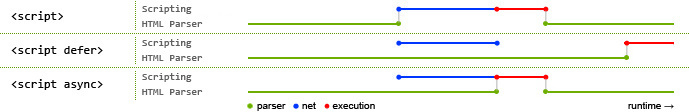

<https://zhuanlan.zhihu.com/p/24944905>

## JS 和 CSS 的位置对资源加载顺序的影响

### 重要结论
**JS 全阻塞，CSS 半阻塞**：

1. JS 会阻塞后续 DOM 解析以及其它资源(如 CSS，JS 或图片资源)的加载。
2. CSS 不会阻塞后续 DOM 结构的解析，不会阻塞其它资源(如图片)的加载，但是会阻塞 JS 文件的加载。
3. 现代浏览器很聪明，会进行 prefetch（预读取）优化，浏览器在获得 html 文档之后会对页面上引用的资源进行提前下载。(注意仅仅只是提前下载，具体什么时候执行要看 html 的结构)

#### 对于第1.的解释
- JS 运行在浏览器中，是单线程的，每个 window 一个 JS 线程，所以当然会阻塞后续 DOM 树的解析咯。
- JS 有可能会修改 DOM 结构，给 DOM 添加样式等等，所以这就意味着在当前 JS 加载执行完成前，后续资源的加载可能是没有意义的。


#### 对于第2.的解释
JS 代码在执行前，浏览器必须保证在 JS 之前的所有 CSS 样式都解析完成，不然就乱套了，**前面的 CSS 样式可能会覆盖 JS 文件中定义的元素样式，这是 CSS 阻塞后续 JS 执行的根本原因**。

### 对实践的指导
我们在开发的时候应该尽可能地:

1. 将样式或 CSS 文件定义在 head 中，并且在处理此类请求的时候应该尽快能够响应(CDN 什么的)，如果请求一个 CSS 文件都要 10s 的话，那你这页面估计没多少人有耐心等下去。
2. 将 JS 脚本文件放在 body 底部，让 DOM 结构能优先渲染出来，避免 DOM 被阻塞。
3. 当编写比较耗时的 JS 代码时候尽可能使用异步的方式进行加载，比如 setTimeout, ajax 等等，同样也是为了避免页面渲染耗时过长，影响用户体验

### 关于defer, async的script
JS 会阻塞后续 DOM 解析以及其它资源(如 CSS，JS 或图片资源)的加载，这是在没有考虑到 defer, async 的情况下。

当浏览器碰到 script 脚本的时候：***(不考虑浏览器的 prefetch)***

1. 没有 defer 或 async，浏览器会立即加载并执行指定的脚本，“立即”指的是在渲染该 script 标签之下的文档元素之前，也就是说不等待后续载入的文档元素。当然还得等待前面的 CSS 文件渲染完。

2. 有 async，加载和渲染后续文档元素的过程将和 script.js 的加载与执行并行进行(下载异步，执行同步)。
```
<script async src="script.js"></script>
```

3. 有 defer，加载后续文档元素的过程将和 script.js 的加载并行进行（异步），但是 script.js 的执行要在所有元素解析完成之后，DOMContentLoaded 事件触发之前完成。***立即加载，延迟执行***
```
<script defer src="script.js"></script>
```

上述3种script的加载、解析时间线可用下图表示：



***蓝色线代表网络读取，红色线代表执行时间，这俩都是针对脚本的；绿色线代表 HTML 解析。***

#### 小结
总结：

1. 由于现代浏览器都存在 prefetch，所以 defer, async 可能并没有太多的用途，可以作为了解扩展知识，仅仅将脚本文件放到 body 底部就可以起到很不错的优化效果。
2. defer 和 async 都是异步加载脚本文件。
3. 慎用 async，因为它完全不考虑依赖关系，只要下载完后就加载，不考虑此时页面样式先后的加载顺序，不过它对于那些可以不依赖任何脚本或不被任何脚本依赖的脚本来说却是非常合适的，最典型的例子：Google Analytics。
4. 耗时较长的脚本代码可以使用 defer 来推迟执行。

### 补充知识
可以看《JavaScript高级程序设计》第2章 2.1