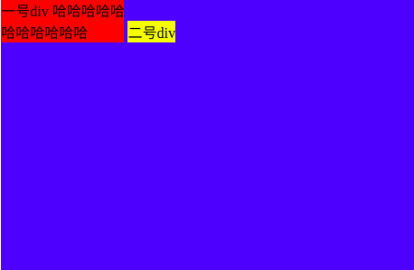
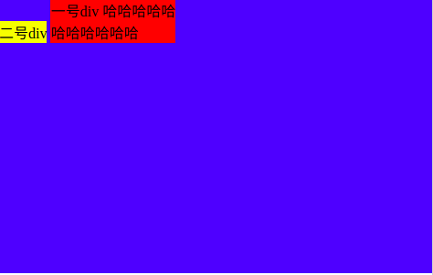
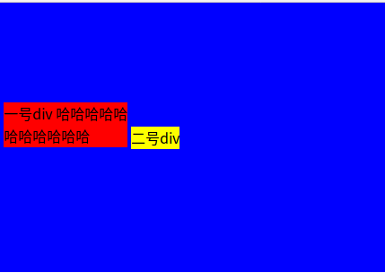
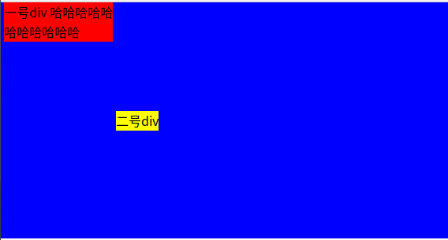

# 关于多元素垂直居中

## 一、场景描述

- 一个高度固定的div，做为父元素。
- 数个高度随机的div,做为子元素，需要在父元素内被垂直居中。

## 二、相关概念回顾

### 1.几种box

- inline box：display为inline或inline-block的元素会形成inline box；行内文本会形成inline box；
- line box：一行内所有的inline boxes会构成line box。其中inline box中高度最高的那个的高度便是line box的高度。

### 2.几种line

- baseline(基线)
- ascendar height(上沿)
- descender height(下沿)
- x-height


另外还有[line-height](https://developer.mozilla.org/zh-CN/docs/Web/CSS/line-height):对于块级元素，它指定元素行盒（line box）的最小高度。对于非替代的inline元素，它用于计算行盒（line box）的高度。它是继承属性

更多解释参见[深入理解 CSS：字体度量、line-height 和 vertical-align](https://zhuanlan.zhihu.com/p/25808995)


### 3. css属性 vertical-align

参考[MDN文档](https://developer.mozilla.org/zh-CN/docs/Web/CSS/vertical-align)可知:

CSS 的属性 vertical-align 用来指定行内元素（inline）或表格单元格（table-cell）元素的垂直对齐方式。

#### 使用场景
mdn文档上是这样描述的：

1. to vertically align an inline element's box inside its containing line box. For example, it could be used to vertically align an  in a line of text.（设置一个inline元素的box相对于 **包含它的line box** 在垂直方向上的位置）
2. to vertically align the content of a cell in a table（设置一个table中的一个cell的内容在垂直方向上的位置）

#### 相关特性

- 初始值:baseline
- 适用元素: 
  - inline-level 元素
  - table-cell 元素. 
  - ::first-letter and ::first-line.
- 是否是继承属性	否
- Percentages: refer to the line-height of the element itself（相对于该元素自己的line-height）

补充知识点:

[::first-letter](https://developer.mozilla.org/zh-CN/docs/Web/CSS/::first-letter) 会选中某 block-level element（块级元素）第一行的第一个字母，并且文字所处的行之前没有其他内容（如图片和内联的表格）

[::first-line](https://developer.mozilla.org/zh-CN/docs/Web/CSS/::first-line) ::first-line CSS pseudo-element （CSS伪元素）在某 block-level element （块级元素）的第一行应用样式。

#### 可能值

- baseline:Aligns the baseline of the element with the baseline of **its parent**.将该元素的baseline对准它父元素的baseline
- middle:Aligns the middle of the element with the baseline plus half the x-height **of the parent**.将该元素的baseline对准父元素的baseline + 1/2的x-heihgts

***注意：*** 这些值虽然是相对于父元素而言的，但相对的仅仅是父元素中的一个line box。

## 三、实践

### 1.Step1

#### 代码

html:

```html
  <body>
    <div class="parent">
      <div class="child1">
        我是一号div 哈哈哈哈哈<br>哈哈哈哈哈哈
      </div>
      <div class="child2">
        我是二号div
      </div>
    </div>
  </body>
```

css:

```css
.parent {
  height:300px;
  background-color: blue;
}

.child1 {
  background-color: red;
  display: inline-block;
}
.child2 {
  background-color: yellow;
  display: inline-block;
}
```

#### 结果：



#### 发现：

> 1. 默认情况下，两个为inline-block的子元素的vertical-align为baseline。
> 2. 两个inline-block的子元素的baseline在一条线上
> 3. 两个inline-block形成的两个inline box组成的line box的高度是最高的的那个inline-box的高度，即一号div的高度
> 4. **vertical-align是相对于包含这些inline box的line box的位置的，而line box的高度、baseline、middle line的位置都是由最高的那个inline box决定的。**
> 5. 一号div也是由若干个line box构成(一行字就是一个line box)。一号div的baseline就是最后一个（最下面一个）的line box的baseline。那么二号的baseline是它的line box的baseline, 和一号div的baseline重合。同时它俩形成的line box的baseline也和它们各自的baseline都重合。

### 2.Step2

为了验证上述3.可以将html修改一下（css不变）

#### 代码

```html
  <body>
    <div class="parent">
      <div class="child2">
        二号div
      </div>
      <div class="child1">
        一号div，啊啊啊啊啊啊啊啊啊啊<br>啊啊啊啊啊啊啊啊
      </div>
    </div>
  </body>
```
css:同上

#### 结果：



#### 发现：

上述结论3.是对的，且可以得到：

> 4. 所有inline box的baseline的位置是由最高的那个inline box的baseline的位置决定的。

### 3.Step3

我们知道vertical-align是相对于包含这些inline box的line box的位置的，而line box的高度、baseline的位置都是由最高的那个inline box决定的。那么真正的父元素,display为block的这个元素，有没有baseline呢？答案是否定的。在inline-block元素处于block元素内部的情况下，它们两个vertical-align决定的对齐策略针对的是同级的inline-block；也就是说它们的vertical-align造成的结果是它们自己的相互对齐，与父元素无关。

故现在试验一下把父元素变为inline-block的结果。

#### 代码
html:同step1中的html代码。

css:

```css
.parent {
  height:300px;
  background-color: blue;
  display: inline-block;
  line-height: 300px;
}

.child1 {
  background-color: red;
  display: inline-block;
}
.child2 {
  background-color: yellow;
  display: inline-block;
}
```

#### 结果:


此时父元素是inline-block且line-height为300px。由于line-height是继承的，所以两个子元素的line-height也是300px。

另外，由于父元素变成了inline-block，所以其宽度不再自动是body的100%，其宽度变成了由内容决定。（这又涉及到另一个问题：**父子元素尺寸继承规律**参见我的另一篇博客)

#### 发现：

>  6. 当父元素是block时，vertical-align只与同级元素有关，和父元素无关——只和它们自己形成的一个line box有关。
>  7. 当父元素是inline-box时，vertical-align和父元素的line-height相关。

### 4.Step4

实现垂直居中。

既然这些inline-block只和同级元素有关，那么就创建一个高度等于父元素的同级inline-block。然后由于这个高度等于父元素的同级元素是这些inline-block中最高的，故由这些inline box组成的line box的baseline、x-height的位置都由该高度等于父元素的inline-block决定。
#### 代码
html:同step1中的html代码。

css:

```css
.parent {
  height:300px;
  background-color: blue;
}
.parent::before {
  display: inline-block;
  height: 100%;
  content: '';
  vertical-align: middle;
}
.child1 {
  background-color: red;
  display: inline-block;
  vertical-align: middle;
}
.child2 {
  background-color: yellow;
  display: inline-block;
  vertical-align: middle;
}
```
#### 结果


### 5.Step5
为了更深入地也就vertical-align，现在在Step4的基础上，将几个inline-block的vertical-align分别进行修改。

#### 代码
html:同step1中的html代码。

css:

```css
.parent {
  height:300px;
  background-color: blue;
}
.parent::before {
  display: inline-block;
  height: 100%;
  content: '';
  vertical-align: middle;
}
.child1 {
  background-color: red;
  display: inline-block;
}
.child2 {
  background-color: yellow;
  display: inline-block;
  vertical-align: middle;
}
```

#### 结果


给上述child1增加属性:vertical-align:top 结果如下：

#### 发现
8. 每个inline-block都要自己设置vertical-align来决定自己的位置，否则自己的位置就在baseline上。
9. 必须设置基准inline-block的vertical-align为middle。

## 参考资料
<http://zxc0328.github.io/2015/07/23/vertical-align-middle/>
<https://zhuanlan.zhihu.com/p/25808995>
<https://developer.mozilla.org/zh-CN/docs/Web/CSS/vertical-align>