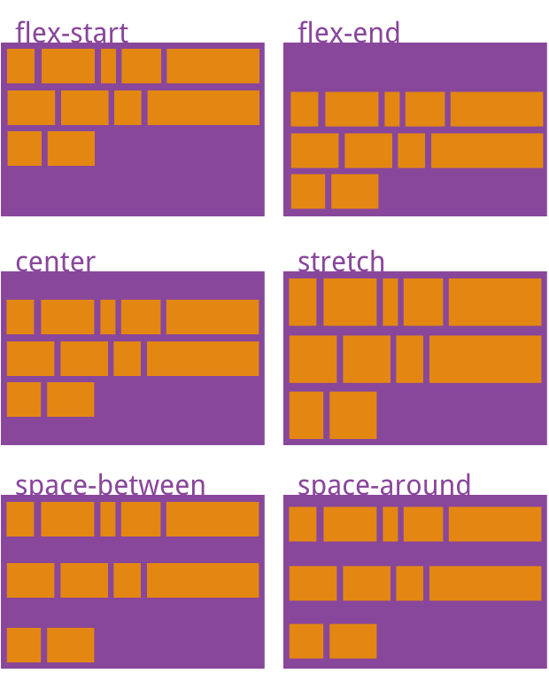

# Flexible Box Layout
## 一、Flex布局概述
Flex，即Flexible Box, 意为"弹性盒",用于为盒装模型提供最大的灵活性。

> 任何一个容器都可以指定为Flex布局。
> 块级元素可设置display:flex; 行内元素可设置display:inline-flex。
> webkit内核的浏览器(Chrome,Safari)，需加上-webkit前缀,即-webkit-flex,-webkit-inline-flex。
> 设为flex布局后，元素的float、clear、vertial-align属性将失效。


### 1. Flex容器和Flex项目:

- Flex容器(flex container): 采用Flex布局的元素。
- Flex项目(flex item): Flex容器的所有子元素。

### 2. 容器的两根轴及相关位置、尺寸
- 主轴(main axis):容器的水平轴
- 交叉轴(cross axis): 容器的垂直轴
- main start:主轴的开始位置，即与边框的交叉点
- main end:主轴的结束位置
- cross start: 交叉轴的开始位置
- cross end:交叉轴的结束位置
- main size: 单个项目占据的主轴空间尺寸(**项目默认沿主轴排列**)
- cross size: 单个项目占据的交叉轴空间尺寸


如下图:


## 二、Flex容器属性
Flex容器有6个属性:
- flex-direction
- flex-wrap
- flex-flow （flex-derection和flex-wrap的简写）
- justify-content
- align-items
- align-content

### 1. flex-direction
决定主轴的方向。

```css
.container {
    flex-direction: row | row-reverse | column | column-reverse
}
```

flex-direction属性可能值:
- row（default）：主轴为水平方向，起点在左端。
- row-reverse：主轴为水平方向，起点在右端。
- column：主轴为垂直方向，起点在上端。
- column-reverse：主轴为垂直方向，起点在下端。

### 2. flex-wrap
规定项目在一条轴线上排不下的时候，如何换行。

```css
.container {
    flex-wrap: nowrap | wrap | wrap-reverse
}
```

flex-wrap属性可能值:
- nowrap(default):不换行
- wrap:换行，第一行在上方
- wrap-reverse:换行，第一行在下方

### 3. flex-flow (简写属性)
是flex-direction和flex-wrap的简写形式。默认为flex-flow: row nowrap

```css
.container {
    flex-flow: <flex-direction>|<flex-wrap>
}
```

### 4. justify-content
定义项目在**主轴**方向上的对齐方式。

```css
.container {
    justify-content: flex-start | flex-end | center | space-between | space-around;
}
```

其具体对齐方式与主轴的方向有关，默认主轴方向是row,在此情况下:

- flex-start(default):左对齐
- flex-end:右对齐
- center: 居中
- space-between: 两端对齐，项目之间的间隔都相等
- space-around: 每个项目两侧的间隔相等，那么项目之间的间隔是项目与边框的间隔的两倍

如下图所示:


### 5. align-items
定义项目在交叉轴方向上的对齐方式（项目可能还是沿主轴排列的）。

```css
.container {
    align-items: flex-start | flex-end | center | baseline | stretch;
}
```

其具体的对齐方式与交叉轴的方向有关。这里假设交叉轴是垂直方向。

- stretch(default):如果项目未设置高度或高度为auto,则将占满整个容器的高度
- flex-start: 上对齐
- flex-end: 下对齐
- center: 垂直居中对齐
- baseline: 项目的第一行文字的baseline(基线)对齐

如下图所示:


### 6. align-content
定义多行主轴的对齐方式。**如果项目只有一行主轴，则该属性不起作用**。

```css
.container {
    align-content: flex-start | flex-end | center | space-between | space-around | stretch;
}
```

align-content属性可能值:
- stretch（default）：轴线占满整个交叉轴。
- flex-start：与交叉轴的起点对齐。
- flex-end：与交叉轴的终点对齐。
- center：与交叉轴的中点对齐。
- space-between：与交叉轴两端对齐，轴线之间的间隔平均分布。
- space-around：每根轴线两侧的间隔都相等。所以，轴线之间的间隔比轴线与边框的间隔大一倍。

如下图所示:


## 三、Flex项目属性
flex项目也有6个属性:

- order
- flex-grow
- flex-shrink
- flex-basis
- flex (flex-grow、flex-shrink、flex-basis的简写)
- align-self

### 1. order
定义项目的排列顺序索引。

```css
.item {
  order: 0|1|2|-1|999
}
```

order属性可能值:所有interger
- 默认为0。
- 可以为负。 
- 数值越小排列越靠前。
- order属性值相等的项目按照书写顺序排列。

如下图所示:


### 2. flex-grow
定义如果存在剩余空间的时候，项目的放大倍数。

```css
.item { 
  flex-grow: 0|1|2|1.2
}
```
可能值:number,不能为负。
- 默认为0。即即使存在剩余空间，也不放大。
- 如果所有项目的flex-grow都为1，则它们将等分剩余空间。
- 如果一个项目的flex-grow为2,其他项目的flex-grow都为1，则前者占据的剩余空间是后者的2倍

如下图所示:


### 3. flex-shrink
定义如果所有项目的默认宽度之和大于容器的时候，项目的缩小比例。

```css
.item {
    flex-shrink: 0|1|2|1.2
}

```

可能值: number,不能为负。
- 默认为1。即如果空间不足，项目将缩小。
- 如果所有项目的flex-shrink都为1，则当空间不足时它们都将等比例缩小。
- 如果一个项目的flex-shrink为0，其他项目的flex-shrink都为1，则当空间不足时前者不缩小，后者缩小。

### 4. flex-basis
定义了项目在主轴方向的初始大小。如果不使用 box-sizing 来改变盒模型的话，那么这个属性就决定了 flex 元素的内容盒（content-box）的宽或者高（取决于主轴的方向）的尺寸大小。浏览器会根据这个属性，计算主轴是否有多余空间。

```css
.item {
    flex-basis: auto|10em|3px|content|fill|max-content|min-content|fit-content;
}
```

flex-basis属性可能值:length
- auto(default)：项目的本来大小
- 可以设为和width或height属性一样的值，这样项目将占据固定空间。

### 5. flex (简写属性)
是flex-grow、flex-shrink、flex-basis的简写形式。后两个属性可选。

可能值:
- 默认为0 1 auto。
- auto: 1 1 auto
- none: 0 0 auto

### 6. align-self
定义单个项目在交叉轴的对齐方式，它可以覆盖容器元素的align-items属性。即该属性允许单个项目有与其他项目不一样的交叉轴对齐方式。

```css
.item {
    align-self: auto | flex-start| flex-end | center | baseline | stretch ;
}
```

可能值:
- auto(default)： 即与父元素的align-items一致。如果没有父元素，则等同于stretch
- flex-start| flex-end | center | baseline | stretch: 与align-items属性完全一致。

## 四、我的实践

```scss
.toprecommend-part {
  box-sizing: content-box;
	background-color: #f2e5da;
	padding-top: 8px;
	min-height: 96px;
	@media only screen and (min-width: 980px){ 
		margin-top:-30px;
	}
	//height: 300px;
	margin-bottom: 30px;
}
.toprecommend-container {
	//position: relative;
	margin:0 auto;
	min-width: 240px;
	max-width: 1220px;
	padding: 0 20px;	
}
.toprecommend-title {
	//font-family: MetricWeb, sans-serif;
	font-size: 16px;
	line-height: 20px;
	margin-top: 0px;
	margin-bottom: 8px;
	padding-bottom: 8px;
	border-bottom: 1px solid #ccc1b7;
	font-weight: 600;
  //position: relative;
  a {
    color: #000;
    text-decoration: none;
    cursor: pointer;
  }
}
.toprecommend-list { //flex容器
	margin-top: 8px;
	margin-bottom: 0px;
	display: flex;//容器中的直系子元素都会变为 flex 元素
  flex-wrap: wrap;
  /* 指定flex元素单行显示还是多行显示:
   * nowrap: flex元素被摆放到一行
   * wrap: flex元素被打断到多个行中
   * wrap-reverse: 和 wrap 的行为一样，但是 cross-start 和 cross-end 互换。
  */
	zoom:1;
	clear: both;
	@media (min-width: 740px) {
	  margin-left: -20px;
	}
}
.toprecommend-item {//flex元素
	display: block;
  flex-basis: 25%;//指定了 flex 元素在主轴方向上的初始大小。如果不使用 box-sizing 来改变盒模型的话，那么这个属性就决定了 flex 元素的内容盒（content-box）的宽或者高（取决于主轴的方向）的尺寸大小。
  /*
	min-width: 25%;
	max-width: 25%;
  width: 25%;
  */
  padding-left: 20px;
  flex: 1 1 0%;
  /** 规定了弹flex元素如何伸长或缩短以适应flex容器中的可用空间。它是一个简写属性，可以同时设置flex-grow, flex-shrink与flex-basis。
  * flex-grow:拉伸因子，为正整数
  * flex-shrink:收缩因子，flex 元素仅在默认宽度之和大于容器的时候才会发生收缩

  */
  -webkit-flex: 1 1 0%;
  -ms-flex: 1 1 0%;
  

  @media (min-width: 740px) {
    padding-left: 20px;
    -webkit-flex: 0 0 0%; //0,0才是不拉伸也不收缩
    flex-basis: 33.33333%;
  }
  @media (min-width: 980px) {// M
    flex-basis: 25%;
  }
}
.toprecommend-item-content {
	padding-bottom: 12px;
	display: flex;
	font-size: 14px;
	line-height: 16px;
	position: relative;
	width: 100%;
	text-rendering: optimizeLegibility;
	-webkit-font-smoothing: antialiased;
}
.toprecommend-item-title {
	-webkit-box-flex: 1;
	-webkit-flex: 1 0 0%;
	-ms-flex: 1 0 0%;
	flex: 1 0 0%;
	-webkit-box-ordinal-group: 3;
	-webkit-order: 2;
	-ms-flex-order: 2;
	order: 2;
	a {
    font-size: 14px;
    line-height: 16px;
    font-weight: 600;
    color: #000;
    &:visited {
      color: #66605c;
    }
    &:hover {
      color: #736c67;
    }
  }
}
.toprecommend-item-image {
   @media (max-width:1220px) {
    display: none;
  }
  width: 30%;
  -webkit-flex-shrink: 0;
  -ms-flex-negative: 0;
  flex-shrink: 0;
  padding: 4px 10px 0 0;
  img {
   display: block;
  }
  a {
    display: block;
    text-decoration: none;
    cursor: pointer;
  }
}
```

```html
<div class="toprecommend-part">
    <div class="toprecommend-container">
        <h2 class="toprecommend-title">
            <a class="list-link" href="#">为您推荐</a>
        </h2>
        <ul id="story-recommend-top" class="toprecommend-list">
          <li class="toprecommend-item">
            <div class="toprecommend-item-content">
                <div class="toprecommend-item-title">
                    <a href="/story/001063419?tcode=smartrecommend&amp;ulu-rcmd=undefined">
                        并不风光的中产阶级
                    </a>
                </div>
                <div class="toprecommend-item-image">
                    <a href="/story/001063419?tcode=smartrecommend&amp;ulu-rcmd=undefined">
                        
                    </a>
                </div>
            </div>
        </li>
        <li class="toprecommend-item">
            <div class="toprecommend-item-content">
                <div class="toprecommend-item-title">
                    <a href="/story/001062572?tcode=smartrecommend&amp;ulu-rcmd=undefined">
                        新加坡吸引绿地FDI全球居首
                    </a>
                </div>
                <div class="toprecommend-item-image">
                    <a href="/story/001062572?tcode=smartrecommend&amp;ulu-rcmd=undefined">
                        
                    </a>
                </div>
            </div>
        </li>
        <li class="toprecommend-item">
            <div class="toprecommend-item-content">
                <div class="toprecommend-item-title">
                    <a href="/story/001063662?tcode=smartrecommend&amp;ulu-rcmd=undefined">
                        中国经济疲弱对全球影响甚微
                    </a>
                </div>
                <div class="toprecommend-item-image">
                    <a href="/story/001063662?tcode=smartrecommend&amp;ulu-rcmd=undefined">
                        
                    </a>
                </div>
            </div>
        </li>
        <li class="toprecommend-item">
            <div class="toprecommend-item-content">
                <div class="toprecommend-item-title">
                    <a href="/story/001060926?tcode=smartrecommend&amp;ulu-rcmd=undefined">
                        “奇怪”的中印增长数据
                    </a>
                </div>
                <div class="toprecommend-item-image">
                    <a href="/story/001060926?tcode=smartrecommend&amp;ulu-rcmd=undefined">
                        
                    </a>
                </div>
            </div>
        </li>
      </ul>
    </div>
</div>
```

## 参考资料

<https://developer.mozilla.org/en-US/docs/Glossary/Flex>

<https://developer.mozilla.org/en-US/docs/Web/CSS/display>

[Flex布局教程：语法篇](http://www.ruanyifeng.com/blog/2015/07/flex-grammar.html)

[Flex布局教程：实例篇](http://www.ruanyifeng.com/blog/2015/07/flex-examples.html)(内含骰子布局、网格布局、圣杯布局）