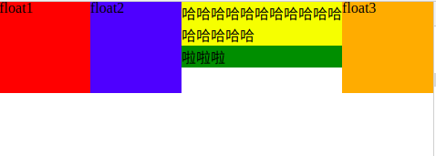
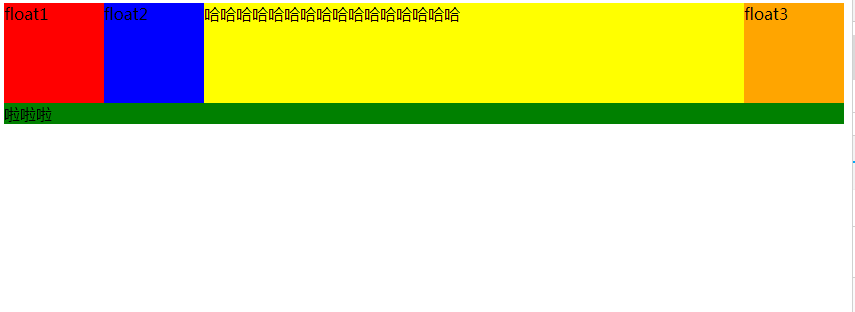
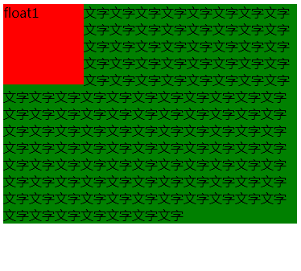

## 简介
块级格式化上下文（Block Formatting Context, BFC）是Web页面的可视化CSS渲染的一部分，是布局过程中生成块级盒子的区域，也是浮动元素与其他元素的交互限定区域。

创建了块格式化上下文的元素中的所有内容都会被包含到该BFC中。

## 创建BFC的方式
- 根元素或包含根元素的元素
- 浮动元素（元素的 float 不是 none）
- 绝对定位元素（元素的 position 为 absolute 或 fixed）
- 行内块元素（元素的 display 为 inline-block）
- 表格单元格（元素的 display为 table-cell，HTML表格单元格默认为该值）
- 表格标题（元素的 display 为 table-caption，HTML表格标题默认为该值）
- 匿名表格单元格元素（元素的 display为 table、table-row、 table-row-group、table-header-group、table-footer-group（分别是HTML table、row、tbody、thead、tfoot的默认属性）或 inline-table）
- overflow 值不为 visible 的块元素
- display 值为 flow-root 的元素
- contain 值为 layout、content或 strict 的元素
- 弹性元素（display为 flex 或 inline-flex元素的直接子元素）
- 网格元素（display为 grid 或 inline-grid 元素的直接子元素）
- 多列容器（元素的 column-count 或 column-width 不为 auto，包括 column-count 为 1）
- column-span 为 all 的元素始终会创建一个新的BFC，即使该元素没有包裹在一个多列容器中（标准变更，Chrome bug）。

总结一下，下面的样式只要满足一项就说明这个盒子是BFC:
- float: left/right
- position: fixed/absolute
- display:inline-block/table-cell/table-caption/flex/inline-flex
- overflow: hidden/scroll/auto (即overflow不为visible)

## BFC特点
- BFC是页面上的独立容器，容器里面的子元素不会影响外面的元素
- BFC的区域不会与float元素区域重叠 （此处意为不与其他的float元素区域重叠，当然BFC本身也可能是float元素）
- 计算BFC的高度时，浮动子元素也参与计算
- 浮动定位和清除浮动时只会应用于同一个BFC内的元素。浮动不会影响其它BFC中元素的布局，而清除浮动只能清除同一BFC中在它前面的元素的浮动。
- 外边距折叠（Margin collapsing）也只会发生在属于同一BFC的块级元素之间。

## 使用BFC解决一些实践问题
### 1. BFC解决外边距塌陷问题
#### 问题：例如有这样两个兄弟元素：

```html
  <div class="sibling1">

  </div>
  <div class="sibling2">

  </div>
```

```css
body{
  margin: 0;
}
.sibling1{
  width: 100%;
  height: 100px;
  background: red;
  margin: 20px 0;
}
.sibling2{
  width: 100%;
  height: 200px;
  background: yellow;
  margin: 30px 0;
}
```

效果：


可以看到sibling1的上外边距还是20px， sibling2的下外边距还是30px,但二者中间的空行高度为30px。显然，这里发生了外边距塌陷。

#### 解决：给sibling1或sibling2外面套一个bfc
```css
body{
    margin: 0;
  }
  .bfc {
    overflow: hidden;
  }
  .sibling1{
    width: 100%;
    height: 100px;
    background: red;
    margin: 20px 0;
  }

  .sibling2{
    width: 100%;
    height: 200px;
    background: yellow;
    margin: 30px 0;

  }
``` 
```html
  <div class="bfc">
    <div class="sibling1">

    </div>
  </div>
  <div class="sibling2">

  </div>
```
形成BFC区域后，容器内的元素sibling1不会影响容器外的元素sibling2，故不在发生外边距塌陷问题。

### 2. BFC解决浮动元素比所在容器高度大的问题
#### 问题：例如有浮动元素float1、float2、float3，以及容器container
代码:
```html
  <div class="container">
    <div class="item float1">
      float1
    </div>
    <div class="item float2">
      float2
    </div>
    <div class="item float3">
      float3
    </div>

    哈哈哈哈哈哈哈哈哈哈哈哈哈哈哈哈
  </div>
  <div class="otherbox">
    啦啦啦
  </div>
```

```css
  .container{
    background: yellow;
  }
  .item {
    width: 100px;
    height: 100px;
  }
  .float1 {
    background: red;
    float: left;
  }
  .float2 {
    background: blue;

    float: left;
  }
  .float3 {
    background: orange;

    float:right;
  }
  .otherbox {
    background: green;
  }
```
效果:


可以看到，容器的高度并不会被float元素撑大。而且容器我们的下一个兄弟元素也受到了影响（因为这个othterbox没有设置clear:none)

#### 解决:让foat元素的container变成一个bfc
```css
  .container{
    background: yellow;
    overflow: hidden;
  }
```

效果:


### 3.bfc解决float元素被兄弟元素环绕问题

#### 问题：左图右文，图片为float,那么文字将会出现环绕效果
```css
.pic {
  width: 100px;
  height: 100px;
  background: red;
  float: left;
}
.word {
  background:green;
}
```
```html
<div class="container">
    <div class="pic">
      float1
    </div>
    <div class="word">
      文字文字文字文字文字文字文字文字文字文字文字文字文字文字文字文字文字文字文字文字文字文字文字文字文字文字文字文字文字文字文字文字文字文字文字文字文字文字文字文字文字文字文字文字文字文字文字文字文字文字文字文字文字文字文字文字文字文字文字文字文字文字文字文字文字文字文字文字文字文字文字文字文字文字文字文字文字文字文字文字文字文字文字文字文字文字文字文字文字文字文字文字文字文字文字文字文字文字文字文字文字文字文字文字文字文字文字文字文字文字文字文字文字文字文字文字文字文字文字文字文字文字文字文字
    </div>
    
  </div>
```

效果:



#### 解决：让文字变成bfc
```css
.word {
    background:green;
    overflow: hidden;
  }
```

效果:


## 参考资料
<https://developer.mozilla.org/zh-CN/docs/Web/Guide/CSS/Block_formatting_context>
<http://www.cnblogs.com/asheng2016/p/7281784.html>