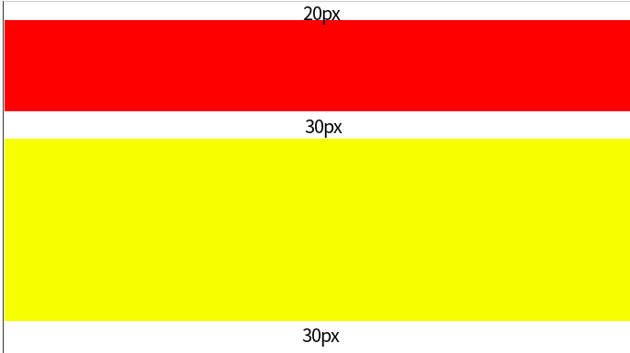
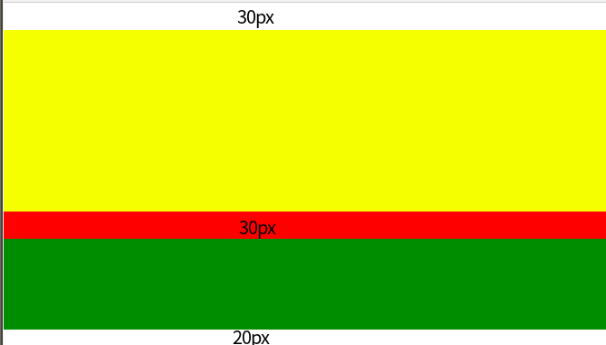
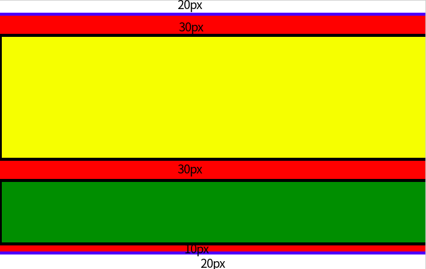

# margin塌陷问题

块的顶部外边距和底部外边距有时被组合(折叠)为单个外边距，其大小是组合到其中的最大外边距，这种行为称为外边距塌陷(margin collapsing)，有的地方翻译为外边距合并。
 
## 注意
- margin塌陷只存在于上下margin,不存在与左右margin
- 浮动元素(float不为none)和绝对定位元素（position为absolute或fixed)不会发生margin塌陷。因为触发了 **格式化上下文(BFC)**

## 发生情况
### 情况1.相邻的兄弟元素（Adjacent siblings）之间
相邻的两个元素之间的外边距会折叠（除非后一个元素需要清除之前的浮动）。

#### 验证1：例如有这样两个兄弟元素：

```html
  <div class="sibling1">

  </div>
  <div class="sibling2">

  </div>
```

```css
body{
  margin: 0;
}
.sibling1{
  width: 100%;
  height: 100px;
  background: red;
  margin: 20px 0;
}
.sibling2{
  width: 100%;
  height: 200px;
  background: yellow;
  margin: 30px 0;
}
```

效果:


可以看到sibling1的上外边距还是20px， sibling2的下外边距还是30px,但二者中间的空行高度为30px。显然，这里发生了外边距塌陷。

#### 验证2：如果给他俩加上内边距和边框呢?
css变成如下这样，html不变：

```css
  .sibling1{
    width: 100%;
    height: 100px;
    background: red;
    margin: 20px 0;
    padding: 10px 0;
    border:thin solid black;
  }
  .sibling2{
    width: 100%;
    height: 200px;
    background: yellow;
    margin: 30px 0;
    border:thin solid black;
    padding: 20px 0;
  }
```
效果和验证1一样，可知边框、内边距的存在对与相邻兄弟元素之间的margin塌陷并不会有影响。

### 情况2. 块级父元素与其第一个/最后一个子元素（Parent and first/last child）

- 如果在父元素与其第一个子元素之间:不存在边框、内边距、行内内容，也没有创建块格式化上下文、或者清除浮动将两者的 margin-top 分开；

- 如果在父元素与其最后一个子元素之间不存在边框、内边距、行内内容、height、min-height、max-height将两者的 margin-bottom 分开；

那么这两对外边距之间会产生折叠。外边距会成为父元素和子元素外边距中较大的那个。

#### 验证3：有父元素和它的两个子元素：

```html
  <div class="parent">
    <div class="firstchild">
    </div>
    <div class="lastchild">
    </div>
  </div>
```

```css
  .parent{
    width: 100%;
    background: red;
    margin: 20px 0;
  }
  .firstchild{
    height: 200px;
    background: yellow;
    margin: 30px 0;
  }
  .lastchild{
    height: 100px;
    background: green;
    margin: 10px 0;
  }
```

效果:



可以看到：
- 父元素的top-margin和firstchild的margin-top发生合并。因为firstchildren的margin-top为30px,大于parent的20px,所以合并后的顶部外边距变为30px。

- 父元素的margin-bottom和lastchild的margin-bottom发生合并。因为lastchild的margin-bottom为10px,小于parent的20px,所以合并后的外边距变为20px。

- 另外，firstchild与lastchild发生了情况1中所说的相邻兄弟元素外边距合并。此处的外边距值为firstchild的margin-bottom和lastchild的margin-top中的较大者，即30px。

E:\FT\ad-management-system\client\scss\components\form.scss

#### 验证4：交换上述fistchild和lastchild的边距宽度
```css
.parent{
  width: 100%;
  background: red;
  margin: 20px 0;
}
.firstchild{
  height: 200px;
  background: yellow;
  margin: 10px 0;
}
.lastchild{
  height: 100px;
  background: green;
  margin: 30px 0;
}
```
结果是parent和firstchild的margin-top合并后为20px,parent和lastchild的margin-bottom合并后为30px。与我们的理论一样

#### 验证5:给上述三个元素加上border
```css
.parent{
    width: 100%;
    background: red;
    margin: 20px 0;
    border: thick solid blue;
  }
  .firstchild{
    height: 200px;
    background: yellow;
    margin: 30px 0;
    border: thick solid black
  }
  .lastchild{
    height: 100px;
    background: green;
    margin: 10px 0;
    border: thick solid black
  }
```
结果为:


可以看到，在有border把父元素和子元素外边距分开的情况下，是没有发生塌陷的；但是不影响firstchild和lastchild之间发生的塌陷。

### 情况3. 空块元素（Empty blocks） ***验证不成立***
如果一个块级元素中不包含任何内容，并且在其 margin-top 与 margin-bottom 之间没有边框、内边距、行内内容、height、min-height 将两者分开，则该元素的上下外边距会折叠。
#### 验证4：
```html
  <div class="empty">

  </div>
```

```css
.empty{
  width: 0;
  margin: 20px 0;
}
```
结果：并没有发生文档中所说的上下外边距的合并。依然是上外边距20px、下外边距20px.

## 更多参考资料
- mdn 外边距合并文档：<https://developer.mozilla.org/zh-CN/docs/Web/CSS/CSS_Box_Model/Mastering_margin_collapsing>
- 格式化上下文，BFC:<https://developer.mozilla.org/zh-CN/docs/Web/Guide/CSS/Block_formatting_context>

