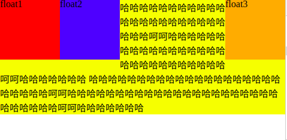
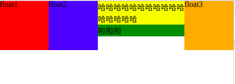
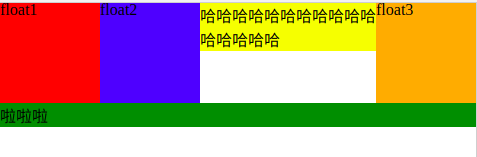
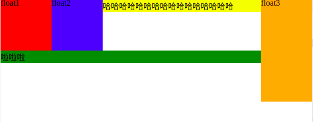

# Float

## 简介
float CSS属性指定一个元素应沿其容器的左侧或右侧放置，允许文本和内联元素环绕它。该元素从网页的正常流动中移除，尽管仍然保持部分的流动性。

**浮动元素是float值不为none的元素**。

可能值：

- left: 表明元素必须浮动在其所在的块容器左侧
- right: 表明元素必须浮动在其所在的块容器右侧
- none:元素不进行浮动

## 特点
### 1. 块布局
float意味着使用块布局。

**float会将所应用元素的display值修改为block**。即如果元素本身的display为inline、inline-block、inline-table、table-row、table-row-group、table-column、table-column-group、table-cell等，那么变为浮动元素后该display值会被修改为block。 

**float对flex、inline-flex不起作用**。如果元素的display为flex、inline-flex，则不会被修改，因为float对它们不起作用。

### 2. 浮动定位
当一个元素浮动之后，它会被移除正常的文档流，然后向左或向右平移，**一直平移直到碰到所处容器的边框，或者碰到另外一个浮动的元素**。

### 3. 受所在容器高度影响
**正常的浮动定位效果的实现需要满足前提条件:浮动元素的高度比其所在容器的高度小**。

如果浮动元素的高度比其所在容器的高度大。那么容器也不会被该浮动元素撑大，所以容器下面的兄弟元素也会跑到浮动元素的一侧。如果不想要浮动元素也浮动在容器接下来的兄弟元素的一侧，那么需要对容器的该兄弟元素进行 **清除浮动**(clear属性)。

## 实践
### 1. 浮动元素高度比所在容器高度小
代码：

```html

  <div class="container">
    <div class="item float1">
      float1
    </div>
    <div class="item float2">
      float2
    </div>
    <div class="item float3">
      float3
    </div>
    哈哈哈哈哈哈哈哈哈哈哈哈哈哈哈哈哈哈哈哈哈哈哈哈哈呵呵哈哈哈哈哈哈哈哈哈哈哈哈哈哈哈哈哈哈哈哈哈哈哈哈哈哈哈哈呵呵哈哈哈哈哈哈哈
    哈哈哈哈哈哈哈哈哈哈哈哈哈哈哈哈哈哈哈哈哈哈哈哈哈呵呵哈哈哈哈哈哈哈哈哈哈哈哈哈哈哈哈哈哈哈哈哈哈哈哈哈哈哈哈呵呵哈哈哈哈哈哈哈
  </div>
```

```css
  .container{
    background: yellow;
  }
  .item {
    width: 100px;
    height: 100px;
  }
  .float1 {
    background: red;
    float: left;
  }
  .float2 {
    background: blue;

    float: left;
  }
  .float3 {
    background: orange;

    float:right;
  }
```

效果：



### 2. 浮动元素比所在容器高度大
代码:
```html
  <div class="container">
    <div class="item float1">
      float1
    </div>
    <div class="item float2">
      float2
    </div>
    <div class="item float3">
      float3
    </div>

    哈哈哈哈哈哈哈哈哈哈哈哈哈哈哈哈
  </div>
  <div class="otherbox">
    啦啦啦
  </div>
```

```css
  .container{
    background: yellow;
  }
  .item {
    width: 100px;
    height: 100px;
  }
  .float1 {
    background: red;
    float: left;
  }
  .float2 {
    background: blue;

    float: left;
  }
  .float3 {
    background: orange;

    float:right;
  }
  .otherbox {
    background: green;
  }
```
效果：



## 3. 当浮动元素比所在容器高度大时，消除对容器后面的元素的影响（清除浮动)
代码：

在2.的基础上，给.otherbox的样式改为:

```css
.otherbox {
  background: green;
  clear: both;
}
```

效果：



如果仅仅只clear一边的浮动元素:

```css
 .container{
    background: yellow;
  }
  .item {
    width: 100px;
    height: 100px;
  }
  .float1 {
    background: red;
    float: left;
  }
  .float2 {
    background: blue;

    float: left;
  }
  .float3 {
    background: orange;
    height: 200px; /*为了看清清楚左右浮动的区别，将float3高度改为200px*/
    float:right; 
  }
  .otherbox {
    background: green;
    clear: left;
  }
```
效果：



clear:right效果同理。

# clear

## 适用例子

见ad-management/views/templates/mobileInfoFlow.html

## 知识点资源
<https://developer.mozilla.org/zh-CN/docs/Web/CSS/clear>

<https://developer.mozilla.org/zh-CN/docs/CSS/float>