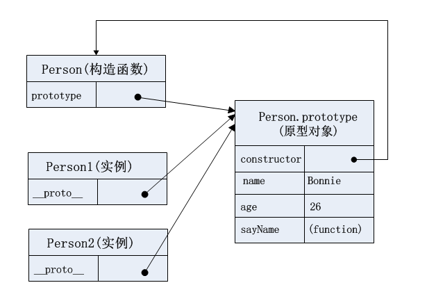

## 一、创建对象的重要模式： 原型模式
面向对象的语言可以通过类创建任意多个具有相同属性和方法的对象。ECMAScript中没有类的概念（在ES6的class之前），但是它的 **对象**是基于**引用类型**创建的，可以在一定程度上充当"类“的角色。

JavaScript创建对象最常用的方法是使用 **Object构造函数**（即通过new Object())或 **对象字面量**。但它们有个明显缺点：如果创建的一堆对象中都含有相同的方法，那么就会重复写大量重复的代码。所以会采用 **工厂模式**、**构造函数模式** 、**原型模式**等设计模式来创建对象。其中 **原型模式**是本文需要着重分析的。

### 1.原型模式基本实现
Eg1:

```js
function Person() {
}

Person.prototype.name = "Bonnie";
Person.prototype.age = 26;
Person.prototype.sayName = function() {
  console.log(this.name)
}

var person1 = new Person();
var person2 = new Person();

console.log(person1.sayName === person2.sayName);//true
```

### 2. 原型模式相关概念理解

#### (1)构造函数
构造函数是专门用来创建对象的函数，其本身也是函数。构造函数始终都应该以一个大写字母开头。

要使用构造函数创建新实例，必须使用new操作符。

#### (2)prototype属性：属于构造函数，指向原型对象
无论何时何地，只要创建了一个函数，那么该函数就会获得一个prototype属性，这个prototype属性是一个指针，指向该函数的 **原型对象**。

#### (3)原型对象
原型对象的用途是它包含了可以由 **特定类型的所有实例（即由同一个构造函数创建的实例）共享的属性和方法**。

#### (4)constructor属性：属于原型对象，指向构造函数
默认情况下，原型对象都会自动获得一个constructor属性，这个constructor属性是一个指针，指向构造函数。

#### (5)实例
实例是通过构造函数通过new操作符创建的对象。

#### (6)__proto__：属于实例，指向原型对象
通过构造函数创建的实例会包含一个__proto__属性，这个__proto__属性是一个指针，指向构造函数的 **原型对象**。

***NOTE:*** 这个属性其实被称为[[Prototype]],在js中无标准方式访问。在Firefox、Safari、Chrome中js可以通过__proto__属性访问，在其它地方没有办法访问。

构造函数、原型对象、实例的关系可以用下图表示：


具体到上Eg1，可以用下图表示:



### 3.原型模式相关规律

#### （1）实例属性会屏蔽原型属性

如果在实例中添加了一个属性，该属性与原型中的一个属性同名，那么就会在该实例中创建该属性，**该属性会屏蔽原型中的同名属性**，但 **不会修改原型中的同名属性，即使将该属性设为null**。

使用delete操作符删除实例中的属性后，**实例就恢复了对原型中同名属性的连接**。


Eg2:

```js
function Person() {
}

Person.prototype.name = "Bonnie";
Person.prototype.age = 26;
Person.prototype.sayName = function() {
  console.log(this.name)
}

var person1 = new Person();
var person2 = new Person();

person1.name = 'Summer';
console.log(person1.name);//'Summer'
console.log(person2.name);//'Bonnie'
```
#### (2) 重写整个原型对象，原型对象会丧失constructor属性的指向

Eg3:

```js
function Person() {
}

Person.prototype = {
  name:'Bonnie',
  age:26,
  sayName:function() {
    console.log(this.name);
  }
}

var person3 = new Person();
person3.constructor === Person;//false NOTE:实例会继承原型对象上的constructor方法。

```

如下重新调整constructor:

```js
Person.prototype.constructor = Person;
person3.constructor === Person;//true

//但是这样会使constructor属性变为可枚举属性
Object.getOwnPropertyNames(Person.prototype);//["name", "age", "sayName", "constructor"]
//Object.getOwnPropertyNames包含不可枚举属性
Object.keys(Person.prototype);// ["name", "age", "sayName", "constructor"]
//Object.keys不包含不可枚举属性
```

更好的办法是这样调整constructor:

```js
Object.defineProperty(Person.prototype, 'constructor',{
  enumerable: false,
  value: Person
});
person3.constructor === Person;//true

Object.getOwnPropertyNames(Person.prototype);//["name", "age", "sayName", "constructor"]
Object.keys(Person.prototype);//["name", "age", "sayName"]
```

#### (3)原型的动态性

对原型对象在任何时候所做的任何修改都能立即从实例中反映出来。

先创建实例再修改原型:

Eg4:

```js
var person4 = new Person();
person4.sayHello();//Uncaught TypeError:person4.sayHello is not a function
Person.prototype.sayHello = function() {
  console.log('hello!');
}
person4.sayHello();//hello
```

但是 **如果对原型对象进行整个重写**，那么就切断了实例与原型对象的联系，即 **实例的__proto__指针不再指向原型对象**。

Eg5:

```js
var person5 = new Person();
person5.sayHi();//Uncaught TypeError:person4.sayHi is not a function

Person.prototype = {
  name:'Bonnie',
  age:26,
  sayName: function() {
    console.log(this.name)
  },
  sayHi: function() {
    console.log('hi~');
  }
}

person5.sayHi();//Uncaught TypeError:person4.sayHi is not a function

```

#### (4)原型模式具有共享本性，不但共享方法，也会共享属性（不合理）

如果共享的是方法，那么非常合适;

如果共享的是基本值，那么通过在实例上添加同名属性，可以覆盖原型中的同名属性;

但是如果共享的是引用类型值（如数组），那么如果在一个实例上修改，也会影响到其他属性。

例如共享的是数组:

Eg6:
```js
  function Person() {
  }

  Person.prototype.name = "Bonnie";
  Person.prototype.age = 26;
  Person.prototype.sayName = function() {
    console.log(this.name)
  }
  Person.prototype.friends = ['Summer','Huiyun'];

  var person1 = new Person();
  var person2 = new Person();

  person1.friends.push('Angela');//如果直接push修改，会影响其他实例
  console.log(person1.friends);//['Summer','Huiyun','Angela'];
  console.log(person2.friends);//['Summer','Huiyun','Angela'];

  person1.friends = ['Angela'];//如果直接赋值覆盖，则不会影响其他实例
  console.log(person1.friends);//['Angela'];
  console.log(person2.friends);//['Summer','Huiyun','Angela'];
```

为了解决这个问题，将构造函数模式和原型模式组合起来使用将是个好办法。
**组合使用构造函数模式和原型模式:**

Eg6:

```js
function Person(name,age) {
  this.name = name;
  this.age = age;
  this.friends = ['Tom', 'Lulu'];
}
Person.prototype.sayName = function () {
  console.log(this.name);
}

var person6 = new Person('Kate', 18);
var person7 = new Person('Bob', 28);
console.log(person6.friends);//["Tom", "Lulu"]
console.log(person7.friends);//["Tom", "Lulu"]
person6.friends.push('Linda');
console.log(person6.friends);// ["Tom", "Lulu", "Linda"]
console.log(person7.friends);//["Tom", "Lulu"]
```
这样每个实例都有一份自己的属性副本，又共享着对方法的引用。

### 4. 原型模式相关方法

#### （1）原型对象.isPrototypeOf(实例)

验证某原型对象是否为某实例的原型对象。

```js
Person.prototype.isPrototypeOf(person1);// true
```

#### (2)Object.getPrototypeOf(实例)

获取实例的原型对象。

```js
Object.getPrototypeOf(person1) === Person.prototype;//true
```

#### (3)实例.hasOwnProperty(属性)

检测一个属性是否存在于实例本身中，还是存在于原型中。

```js
person1.hasOwnProperty('name');//true
person2.hasOwnProperty('name');//false
```

#### (4) in
通过对象能够访问给定的属性，则返回true，**无论该属性是在实例还是在原型中**, **无论该属性是否可枚举**。

```js
'name' in person1;//true
'name' in person2;//true
```

#### (5) for...in
for...in循环返回对象所有的 **可枚举** 属性，**无论该属性是在实例还是在原型中**。

```js
for (let prop in person1) {
  console.log(`${prop}: ${person1[prop]}`);
} 
/** 输出:
name: Summer
age: 26
sayName: function() {
  console.log(this.name)
}
*/
```

#### (6) Object.keys(对象)
取得对象上所有的 **可枚举** 的 **实例** 属性组成的数组

```js
Object.keys(person1);//["name"]
Object.keys(person2);//[]
```

#### (7) Object.getOwnPropertyNames(对象)

获取对象的所有 **实例** 属性，**无论该属性是否可枚举**。

#### 方法(3)~(7)特点对比总结

方法             | 是否包含不可枚举属性 | 是否查找prototype链
-----------------|--------------------|-------------------
hasOwnProperty   | √           |×
in               | √           |√
for...in         | ×           |√
Object.keys()    | ×           |×
Object.getOwnPropertyNames()|√  |×

## 二、实现继承的主要方法：原型链

ECMAScript将 **原型链** 作为实现继承的主要方法。

**原型链**的基本思想就是 让一个引用类型继承另一个引用类型的属性和方法。参考构造函数、原型对象、实例直接的关系，原型链的形成就是让 **一个类型的实例** 作为 **另一个类型** 的 **原型对象**。

### 1.原型链基本实现

```js
function SuperType() {
  this.superProperty = true;
}

SuperType.prototype.getSuperValue = function() {
  return this.superProperty;
}

function SubType() {
  this.subProperty = false;
}

SubType.prototype = new SuperType(); //将 SuperType类型的实例 作为 SubType类型的 原型对象, 这样就重写了SubType的原型对象(没有使用SubType默认的原型对象）， 实现了继承。

SubType.prototype.getSubValue = function() {
  return this.subProperty;
}

const subTypeInstance = new SubType();
console.log(subTypeInstance.getSuperValue());//true
```

这样SubType的实例（即subTypeInstance）的__proto__指向SuperType的实例（即SubType的原型），SuperType的实例的__proto__又指向SuperType的原型。

***NOTE：*** 

- 这时候subTypeInstance的constructor指向的是SuperType而非SubType，因为SubType的prototype被重写为SuperType的实例。


### 2. 实现原型链的相关注意点

#### (1) 所有函数的默认原型对象都是Object类型的实例

所有函数的默认原型都是Object类型的实例，故 **SuperType的原型对象（即SuperType.prototype）就是Object类型的实例**，其__proto__指向的Object类型的原型对象。***比较绕***

上例可以总结为，SubType继承了SuperType,SuperType继承了Object。

#### (2) instanceof和isPrototypeOf() 测试实例的原型链

instanceof可以测试某个实例的类型和其继承的类型。

```js
subTypeInstance instanceof SubType;//true
subTypeInstance instanceof SuperType;//true
subTypeInstance instanceof Object;//true
```

isPrototypeOf()也可以测试某个实例的原型链中出现过的原型对象

```js
SubType.prototype.isPrototypeOf(subTypeInstance);//true
SuperType.prototype.isPrototypeOf(subTypeInstance);//true
Object.prototype.isPrototypeOf(subTypeInstance);//true
```

#### (3)子类型给继承的原型对象添加/重写方法 必须在 子类型的原型对象已经替换为新的原型对象 之后

```js

function SuperType() {
  this.superProperty = true;
}

SuperType.prototype.getSuperValue = function() {
  return this.superProperty;
}

function SubType() {
  this.subProperty = false;
}

SubType.prototype = new SuperType(); //*1 替换SupType的默认原型对象为 SuperType的实例，实现继承

SubType.prototype.getSubValue = function() {
  return this.subProperty;
}

SubType.prototype.getSuperValue = function() { //*2 在原型对象替换为新的之后，再给继承的原型对象添加/重写方法
  return 'newSuperValue';
}

var subTypeInstance = new SubType();
var superTypeInstance = new SuperType();
subTypeInstance.getSuperValue();//'newSuperValue' 重写原型对象中已经存在的方法后会屏蔽原型对象的旧方法
superTypeInstance.getSuperValue();//true 重写原型对象中已经存在的方法后，对于原型对象的类型本身的实例没有影响

```

如果将*2 放在 *1之前，则重写不能生效：

```js
function SuperType() {
  this.superProperty = true;
}

SuperType.prototype.getSuperValue = function() {
  return this.superProperty;
}

function SubType() {
  this.subProperty = false;
}

SubType.prototype.getSuperValue = function() { //在原型对象替换为新的之后，再给继承的原型对象添加/重写方法
  return 'newSuperValue';
}

SubType.prototype = new SuperType(); //替换SupType的默认原型对象为 SuperType的实例，实现继承

SubType.prototype.getSubValue = function() {
  return this.subProperty;
}


var subTypeInstance = new SubType();
var superTypeInstance = new SuperType();
subTypeInstance.getSuperValue();//true
superTypeInstance.getSuperValue();//true
```

#### (4)子类型实例对继承的原型对象添加/重写方法，不能使用对象字面量的方式
如果使用对象字面量的方式重写，则会重写整个原型链，之前所做的对原型对象的替换就是无效的。

```js
function SuperType() {
  this.superProperty = true;
}

SuperType.prototype.getSuperValue = function() {
  return this.superProperty;
}

function SubType() {
  this.subProperty = false;
}

SubType.prototype = new SuperType(); //*1 替换SupType的默认原型对象为 SuperType的实例，实现继承

SubType.prototype = { //对象字面量的方式重写，是的*1行无效
  getSubValue: function() {
    return this.subProperty;
  },
  getSuperValue: function() {
    return 'newSuperValue'
  }
}

var subTypeInstance = new SubType();
subTypeInstance.getSuperValue();//'newSuperValue' 

console.log(subTypeInstance instanceof SuperType);//false

```

#### （5）子类型实例对继承的原型对象修改引用类型值，会影响其他所有子类型实例的属性，但是不会影响原型链上其他被继承类型的实例的属性

```js

function SuperType() {
  this.superProperty = true;
  this.colors = ['red', 'yellow'];
}

SuperType.prototype.getSuperValue = function() {
  return this.superProperty;
}

function SubType() {
  this.subProperty = false;
}

SubType.prototype = new SuperType(); 

var subTypeInstance = new SubType();
var subTypeInstance2 = new SubType();
var superTypeInstance = new SuperType();

subTypeInstance.colors.push('green');//*1
console.log(subTypeInstance.colors);//["red", "yellow", "green"]
console.log(subTypeInstance2.colors);//["red", "yellow", "green"]
console.log(superTypeInstance.colors);//["red", "yellow"]
```
交换*1和 *2 行的位置，结果依然一样：

```js

function SuperType() {
  this.superProperty = true;
  this.colors = ['red', 'yellow'];
}

SuperType.prototype.getSuperValue = function() {
  return this.superProperty;
}

function SubType() {
  this.subProperty = false;
}

SubType.prototype = new SuperType(); 

var subTypeInstance = new SubType();


subTypeInstance.colors.push('green');//*2

var subTypeInstance2 = new SubType();
var superTypeInstance = new SuperType();//*1

console.log(subTypeInstance.colors);//["red", "yellow", "green"]
console.log(subTypeInstance2.colors);//["red", "yellow", "green"]
console.log(superTypeInstance.colors);//["red", "yellow"]
```
## 三、创建对象的其他模式(原型模式以外)

### 3.1 工厂模式
#### 1. 代码示例
```js
function person(name, age) {
  var p = new object();
  p.name = name;
  p.age = age;
  p.sayName = function() {
    console.log(this.name);
  };
  return p;
}

var person1 = person('Bonnie', 26);
var person2 = person('Summer', 24);
```

#### 2. 优点
解决了创建多个相似对象的问题。

#### 3. 缺点
没有解决对象识别的问题。

### 3.2 构造函数模式
#### 1. 代码示例
```js
function Person(name, age) {
  this.name = name;
  this.age = age;
  this.sayName = function() {
    console.log(this.name);
  }
}

var person1 = new Person('Bonnie', 26);
var person2 = new Person('Summer', 24);

```
> 牢记：**构造函数在不返回值的情况下，默认会返回新对象的实例**（构造函数模式）。 如果在构造函数内部末尾添加一个return语句，可以重写调用构造函数时返回的值（寄生构造函数模式）。

#### 2.优点
创建自定义的构造函数意味着可以将它的示例标志为一种特定的类型（执行person1 instanceof Person为true)。这就是它比工厂模式更胜一筹的地方。


#### 3.缺点
每个方法都要在每个实例上创建一遍。也就是说，使用构造函数模式创建的每个实例都包含着各自独有的同名函数。然而，创建两个完成同样任务的同名函数并没有必要。

可以像这样使构造函数创建的每个实例都引用一个方法:

```js
function Person(name, age) {
  this.name = name;
  this.age = age;
  this.sayName = sayName;
}
function sayName() {
  console.log(this.name);
}
```

但是这样带来的问题是被构造函数的不同实例共同引用的这个方法存在于全局作用域中，这一方面破坏了全局作用域，另一方面也破坏了该自定义类型的封装性。

### 3.3 原型模式（此处略述，详见一、）
#### 1. 代码示例
```js
function Person() {
}

Person.prototype.name = "Bonnie";
Person.prototype.age = 26;
Person.prototype.sayName = function() {
  console.log(this.name)
}

var person1 = new Person();
var person2 = new Person();
```
#### 2. 优点
可以让所有对象实例共享它所包含的属性和方法。
#### 3. 缺点
首先，它省略了为构造函数传递初始化参数这一环节，这样所有实例默认都会取得相同的属性值。

更严重的是，其共享的本质对于引用类型的属性值（如数组）是非常不适合的：对于修改一个实例上引用类型的属性值也会修改另一个实例上的这个属性值。不过，其共享本质对于函数非常合适，因为方法本来就是共用的。而其对于基本值的属性也比较合适，因为可以通过在实例上添加同名的属性名来覆盖原型中的属性。

### 3.4 组合使用构造函数模式和原型模式
#### 1.代码示例
```js
function Person(name, age) {
  this.name = name;
  this.age = age;
  this.friends = ['Spring', 'Huiyun'];
}
Person.prototype.sayName = function() {
  console.log(this.name);
}

var person1 = person('Bonnie', 26);
var person2 = person('Summer', 24);
```

#### 2. 优点
实例属性都在构造函数中实现，共享的属性和方法在原型中定义，是使用最广、认同度最高的一种创建自定义类型的方式。也是默认方式。

### 3.5 动态原型模式
#### 1. 代码示例
```js
function Person(name, age) {
  this.name = name;
  this.age = age;

  if (typeof this.sayName != 'function') {
    Person.prototype.sayName = function() {
      console.log(this.name);
    }
  }
}

```

#### 2. 优点
只有在某方法不存在的情况下，才将该方法添加到原型上。添加到原型上这段代码只会在初次调用构造函数时才会执行。对原型所做的修改会立刻反映到所有实例中。

> 注意：不能使用对象字面量重写原型，因为如果已经创建了实例，那么重写原型会切断现有实例和新原型之间的联系。

### 3.6 寄生构造函数模式
#### 1. 代码示例
```js
function Person(name, age) {
  var o = new Object();
  o.name = name;
  o.age = age;
  o.sayName = function() {
    console.log(this.sayName);
  }
  return o;
}
var person1 = new Person('Bonnie', 26);
```
除了使用new操作符并把包装的函数叫做构造函数之外，该模式跟工厂模式是一模一样的。构造函数在不返回值的情况下默认返回新对象实例。而通过在构造函数内部末尾添加return语句，可以重写调用构造函数时返回的值。

#### 2. 优点
该模式适于为特殊对象(如Array)创建具有新属性、新方法的实例。也就是说适于在某些已有的特殊类型(如Array)的基础上创建新的特殊类型(如SpecialArray)。

例如可以在Array的基础上，创建具有额外方法的数组:

```js
function SpecialArray() {
  var o = new Array();
  o.push.apply(o, arguments);
  o.getPipedStr = function() {
    return this.join('|');
  }
  return o;
}

var colors = new SpecialArray('red', 'blue', 'green');
console.log(colors);// ["red", "blue", "green", getPipedStr: ƒ]
console.log(colors.getPipedStr);//"red|blue|green"
```

#### 3. 缺点
该模式返回的对象与构造函数以及构造函数的原型之间毫无关系。也就是说，该模式返回的对象与在构造函数外部超级多对象没什么不同。所以构造函数所表示的类型并不是实例的类型。

以上例来说：
```js
colors instanceof SpecialArray;// false
```

### 3.7 稳妥构造函数模式
#### 1. 代码示例
```js
function Person(name, age) {
  var o = new Object();
  //私有变量
  var job = 'developer';

  o.sayName = function() {
    console.log(name);
  }
  o.sayJob = function() {
    console.log(job);
  }
  return o;
}
var person1 = new Person('Bonnie', 26);
person.sayName()//'Bonnie'
person.sayJob()//'Job'
```
该方式创建的对象，除了sayName、sayJob方法以外，没有别的办法访问变量name、job。
#### 2. 优点
该模式提供了固定的方法来访问构造函数中的原始数据（构造函数参数、私有变量）。除提供的方法外，没有其他办法可以访问其构造函数中的原始数据。这种安全性使得稳妥构造函数模式非常适合在某些安全执行环境（如ADsafe、Caja）下使用。

## 四、实现继承的其他方法(原型链以外)

### 4.1 原型链
#### 1. 代码示例
```js
function SuperType() {
  this.superProperty = true;
}

SuperType.prototype.getSuperValue = function() {
  return this.superProperty;
}

function SubType() {
  this.subProperty = false;
}

SubType.prototype = new SuperType(); //将 SuperType类型的实例 作为 SubType类型的 原型对象, 这样就重写了SubType的原型对象(没有使用SubType默认的原型对象）， 实现了继承。

SubType.prototype.getSubValue = function() {
  return this.subProperty;
}

const subTypeInstance = new SubType();
console.log(subTypeInstance.getSuperValue());//true
```

相关分析详见二、

### 4.2 借用构造函数（经典继承）

#### 1.代码示例
```js
function SuperType() {
  this.colors = ['red', 'blue', 'green'];
}

function SubType() {
  SuperType.call(this);//在子类型构造函数内部调用超类型构造函数,继承了SuperType
}

var subTypeInstance1 = new SubType();
subTypeInstance1.colors.push('yellow');
console.log(subTypeInstance1);//['red', 'blue', 'green','yellow']

var subTypeInstance2 = new SubType();
console.log(subTypeInstance2.colors);//['red', 'blue', 'green']
```
基本思想就是在子类型构造函数内部调用超类型构造函数。

#### 2. 优点
##### （1）子类型每个实例都会继承一份独立的超类型属性副本
通过使用call方法（或apply),实际上是在未来新创建子类型实例时当场调用了超类型的构造函数，也就是在初始化子类型实例时才把超类型的属性添加到子类型实例上。那么子类型的每个实例都会拥有一份独立的超类型属性副本。 这样不同的子类型实例对同一个继承来的属性进行修改(例如对数组属性进行push)，也不会互相影响。

##### (2)可以在子类型构造函数中向超类型构造函数传递参数
```js
function SuperType(name) {
  this.name = name;
}

function SubType(name) {
  SuperType.call(this,name);
}

var subTypeInstance1 = new SubType('Bonnie');
console.log(subTypeInstance1.name);//"Bonnie"

var subTypeInstance2 = new SubType('Summer');
console.log(subTypeInstance2.name);//"Summer"
```

#### 3. 缺点
无法避免构造函数模式的问题——使用构造函数模式创建的每个实例都包含着各自独有的同名函数，故函数复用无从谈起（详见3.2）。

而在超类型的原型中定义的方法，对子类而言是不可见的，所以所有子类型都只能通过构造函数模式创建。

### 4.2 组合继承（伪经典继承）
#### 1. 代码示例
```js
function SuperType(name) {
  this.name = name;
  this.colors = ['red', 'blue', 'green'];
}
SuperType.prototype.sayName = function() {
  console.log(this.name);
}

function SubType(name, age) {
  //继承属性
  SuperType.call(this, name);
  //自己的属性
  this.age = age;
}

//继承方法:SubType.prototype也会得到继承的属性，不过会被上述构造函数中call方法继承的属性作为实例属性覆盖掉。
SubType.prototype = new SuperType();
SubType.prototype.constructor = SubType;
//自己的方法
SubType.sayAge = function() {
  console.log(this.age);
}
```

将原型链和借用构造函数组合起来:使用原型链实现对超类型原型上的方法和属性的继承，使用借用构造函数实现对超类型实例属性和方法的继承。一般超类型原型上就只有方法，超类型实例上只有属性（即组合使用构造函数模式和原型模式，参见3.4）。这样一来，该方式就是：用原型链实现对超类型原型上方法的继承，用借用构造函数实现对超类型实例上属性的继承。

#### 3. 优点
组合继承用 **原型链**实现对 **超类型原型上方法**的继承，用 **借用构造函数**实现对 **超类型实例上属性**的继承。这样可以让子类型的不同实例既分别拥有独立的属性（尤其是引用类型属性，如colors数组），又可以共享相同的方法。

**组合继承**避免了原型链和借用构造函数的缺陷，融合了它们的优点，是 **JavaScript中最常用的继承模式**。

### 4.3 原型式继承
#### 1. 代码示例
```js
function object(o) {
  function F(){};//先构造一个临时性的构造函数
  F.prototype = o;//将传入的对象作为该构造函数的原型
  return new F();//返回临时类型的新实例
}

//使用
var person = {
  name:'Bonnie',
  friends: ['Summer', 'Spring']
}

var person1 = object(person);
person1.name = 'Huiyun';
person1.friends.push('Tony');

var person2 = object(person);
person2.name = 'Huiyun';
person2.friends.push('Joy');

console.log(person1.friends);//["Summer", "Spring", "Tony", "Joy"]
console.log(person2.friends);//["Summer", "Spring", "Tony", "Joy"]
console.log(person.friends);//["Summer", "Spring", "Tony", "Joy"]
```
思想： 借助原型可以基于已有的对象（而非类型）创建新对象（而非创建自定义类型）。其实，object对传入其中的对象执行了一次 **浅复制**。

#### 2. 优点
可以基于已有的对象创建新对象，而且还不必创建新类型。适于基于已有对象加以修改得到另一个对象。

在只想让一个对象与另一个对象保持类似，又不想兴师动众创建构造函数的情况下，原型式继承完全可以胜任。

##### 延伸：ES6的Object.create()
该方法规范化了原型式继承，在只传入一个参数的情况下，和上述object达到的效果相同。该方法的第二个参数为新对象额外属性组成的对象，也就是简化了上述object的后续用法。

###### 语法：
```js
Object.create(protoObj, [newPropertiesObj])
```
参数：

- protoObj: 新创建对象的原型对象
- newPropertiesObj：可选。 要添加(或重写)到新对象上的可枚举的实例属性的属性描述符及其名称组成的对象（与Object.defineProperties()的第二个参数相同)。

newPropertyiesObj语法:

```js
{
  prop1Name:{
    value: valueConent,
    writable: false(default)/true
    enumerable: false(default)/true
    configuragle： false(default)/true
  },
  prop2Name: {
    ...
  },
  ...
}
```
详见<https://developer.mozilla.org/zh-CN/docs/Web/JavaScript/Reference/Global_Objects/Object/defineProperties>

返回值： 一个带有指定的原型对象属性和自己新添加的实例属性的对象

###### Eg:
```js
var person = {
  name: 'Bonnie',
  friends: ['Summer','Spring']
}

var person1 = Object.create(person, {
  name:{
   value:'Huiyun'
  }
});

console.log(person1);//{name: "Huiyun"}
console.log(person1.friends);// ["Summer", "Spring"]
```

#### 3.缺点
可以基于已有的对象创建新对象。对新对象修改引用类型属性，已有的基础对象也会受到修改，基于基础对象的其他对象也会受到修改。
### 4.4 寄生式继承

### 4.5 寄生组合式继承

## 四、Es6的Class对继承的实现

## 参考资料
《JavaScirpt高级程序设计》6.2.3，6.3.1

《你不知道的JavaScript(上)》Chapter5