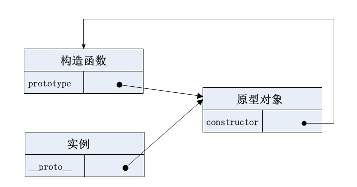
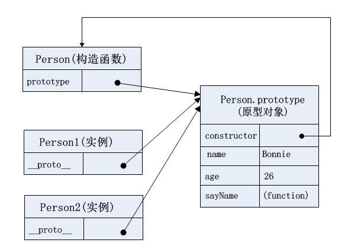

## 一、创建对象的重要模式： 原型模式
面向对象的语言可以通过类创建任意多个具有相同属性和方法的对象。ECMAScript中没有类的概念（在ES6的class之前），但是它的 **对象**是基于 **引用类型**创建的，可以在一定程度上充当“类”的角色。

JavaScript创建对象最常用的方法是使用 **Object构造函数**（即通过new Object())或 **对象字面量**。但它们有个明显缺点：如果创建的一堆对象中都含有相同的方法，那么就会重复写大量重复的代码。所以会采用 **工厂模式**、**构造函数模式** 、**原型模式**等设计模式来创建对象。其中 **原型模式**是本文需要着重分析的。

### 1.原型模式基本实现
Eg1:

```js
function Person() {
}

Person.prototype.name = "Bonnie";
Person.prototype.age = 26;
Person.prototype.sayName = function() {
  console.log(this.name)
}

var person1 = new Person();
var person2 = new Person();

console.log(person1.sayName === person2.sayName);//true
```

### 2. 原型模式相关概念理解

#### (1)构造函数
构造函数是专门用来创建对象的函数，其本身也是函数。构造函数始终都应该以一个大写字母开头。

要使用构造函数创建新实例，必须使用new操作符。

#### (2)prototype属性：属于构造函数，指向原型对象
无论何时何地，只要创建了一个函数，那么该函数就会获得一个prototype属性，这个prototype属性是一个指针，指向该函数的 **原型对象**。

#### (3)原型对象
原型对象的用途是它包含了可以由 **特定类型的所有实例（即由同一个构造函数创建的实例）共享的属性和方法**。

#### (4)constructor属性：属于原型对象，指向构造函数
默认情况下，原型对象都会自动获得一个constructor属性，这个constructor属性是一个指针，指向构造函数。

#### (5)实例
实例是通过构造函数通过new操作符创建的对象。

#### (6)__proto__：属于实例，指向原型对象
通过构造函数创建的实例会包含一个__proto__属性，这个__proto__属性是一个指针，指向构造函数的 **原型对象**。

***NOTE:*** 这个属性其实被称为[[Prototype]],在js中无标准方式访问。在Firefox、Safari、Chrome中js可以通过__proto__属性访问，在其它地方没有办法访问。

构造函数、原型对象、实例的关系可以用下图表示：



具体到上Eg1，可以用下图表示:



### 3.原型模式相关规律

#### （1）实例属性会屏蔽原型属性

如果在实例中添加了一个属性，该属性与原型中的一个属性同名，那么就会在该实例中创建该属性，**该属性会屏蔽原型中的同名属性**，但 **不会修改原型中的同名属性，即使将该属性设为null**。

使用delete操作符删除实例中的属性后，**实例就恢复了对原型中同名属性的连接**。


Eg2:

```js
function Person() {
}

Person.prototype.name = "Bonnie";
Person.prototype.age = 26;
Person.prototype.sayName = function() {
  console.log(this.name)
}

var person1 = new Person();
var person2 = new Person();

person1.name = 'Summer';
console.log(person1.name);//'Summer'
console.log(person2.name);//'Bonnie'
```
#### (2) 重写整个原型对象，原型对象会丧失constructor属性的指向

Eg3:

```js
function Person() {
}

Person.prototype = {
  name:'Bonnie',
  age:26,
  sayName:function() {
    console.log(this.name);
  }
}

var person3 = new Person();
person3.constructor === Person;//false NOTE:实例会继承原型对象上的constructor方法。

```

如下重新调整constructor:

```js
Person.prototype.constructor = Person;
person3.constructor === Person;//true

//但是这样会使constructor属性变为可枚举属性
Object.getOwnPropertyNames(Person.prototype);//["name", "age", "sayName", "constructor"]
//Object.getOwnPropertyNames包含不可枚举属性
Object.keys(Person.prototype);// ["name", "age", "sayName", "constructor"]
//Object.keys不包含不可枚举属性
```

更好的办法是这样调整constructor:

```js
Object.defineProperty(Person.prototype, 'constructor',{
  enumerable: false,
  value: Person
});
person3.constructor === Person;//true

Object.getOwnPropertyNames(Person.prototype);//["name", "age", "sayName", "constructor"]
Object.keys(Person.prototype);//["name", "age", "sayName"]
```

##### 补充知识: 属性描述符和Object.defineProperty()
见我的博客《属性描述符》

#### (3)原型的动态性

对原型对象在任何时候所做的任何修改都能立即从实例中反映出来。

先创建实例再修改原型:

Eg4:

```js
var person4 = new Person();
person4.sayHello();//Uncaught TypeError:person4.sayHello is not a function
Person.prototype.sayHello = function() {
  console.log('hello!');
}
person4.sayHello();//hello
```

但是 **如果对原型对象进行整个重写**，那么就切断了实例与原型对象的联系，即 **实例的__proto__指针不再指向原型对象**。

Eg5:

```js
var person5 = new Person();
person5.sayHi();//Uncaught TypeError:person4.sayHi is not a function

Person.prototype = {
  name:'Bonnie',
  age:26,
  sayName: function() {
    console.log(this.name)
  },
  sayHi: function() {
    console.log('hi~');
  }
}

person5.sayHi();//Uncaught TypeError:person4.sayHi is not a function

```

#### (4)原型模式具有共享本性，不但共享方法，也会共享属性（不合理）

如果共享的是方法，那么非常合适;

如果共享的是基本值，那么通过在实例上添加同名属性，可以覆盖原型中的同名属性;

但是如果共享的是引用类型值（如数组），那么如果在一个实例上修改，也会影响到其他属性。

例如共享的是数组:

Eg6:
```js
  function Person() {
  }

  Person.prototype.name = "Bonnie";
  Person.prototype.age = 26;
  Person.prototype.sayName = function() {
    console.log(this.name)
  }
  Person.prototype.friends = ['Summer','Huiyun'];

  var person1 = new Person();
  var person2 = new Person();

  person1.friends.push('Angela');//如果直接push修改，会影响其他实例
  console.log(person1.friends);//['Summer','Huiyun','Angela'];
  console.log(person2.friends);//['Summer','Huiyun','Angela'];

  person1.friends = ['Angela'];//如果直接赋值覆盖，则不会影响其他实例
  console.log(person1.friends);//['Angela'];
  console.log(person2.friends);//['Summer','Huiyun','Angela'];
```

为了解决这个问题，将构造函数模式和原型模式组合起来使用将是个好办法。
**组合使用构造函数模式和原型模式:**

Eg6:

```js
function Person(name,age) {
  this.name = name;
  this.age = age;
  this.friends = ['Tom', 'Lulu'];
}
Person.prototype.sayName = function () {
  console.log(this.name);
}

var person6 = new Person('Kate', 18);
var person7 = new Person('Bob', 28);
console.log(person6.friends);//["Tom", "Lulu"]
console.log(person7.friends);//["Tom", "Lulu"]
person6.friends.push('Linda');
console.log(person6.friends);// ["Tom", "Lulu", "Linda"]
console.log(person7.friends);//["Tom", "Lulu"]
```
这样每个实例都有一份自己的属性副本，又共享着对方法的引用。

### 4. 原型模式相关方法

#### （1）原型对象.isPrototypeOf(实例)

验证某原型对象是否为某实例的原型对象。

```js
Person.prototype.isPrototypeOf(person1);// true
```

#### (2)Object.getPrototypeOf(实例)

获取实例的原型对象。

```js
Object.getPrototypeOf(person1) === Person.prototype;//true
```

#### (3)实例.hasOwnProperty(属性)

检测一个属性是否存在于实例本身中，还是存在于原型中。

```js
person1.hasOwnProperty('name');//true
person2.hasOwnProperty('name');//false
```

#### (4) in
通过对象能够访问给定的属性，则返回true，**无论该属性是在实例还是在原型中**, **无论该属性是否可枚举**。

```js
'name' in person1;//true
'name' in person2;//true
```

#### (5) for...in
for...in循环返回对象所有的 **可枚举** 属性，**无论该属性是在实例还是在原型中**。

```js
for (let prop in person1) {
  console.log(`${prop}: ${person1[prop]}`);
} 
/** 输出:
name: Summer
age: 26
sayName: function() {
  console.log(this.name)
}
*/
```

#### (6) Object.keys(对象)
取得对象上所有的 **可枚举** 的 **实例** 属性组成的数组

```js
Object.keys(person1);//["name"]
Object.keys(person2);//[]
```

#### (7) Object.getOwnPropertyNames(对象)

获取对象的所有 **实例** 属性，**无论该属性是否可枚举**。

#### 方法(3)~(7)特点对比总结

方法             | 是否包含不可枚举属性 | 是否查找prototype链
-----------------|--------------------|-------------------
obj.hasOwnProperty(PropName)   | √           |×
in               | √           |√
for...in         | ×           |√
Object.keys(obj)    | ×           |×
Object.getOwnPropertyNames(obj)|√  |×

总结：
- 只有方法for...in和Object.keys(obj)与属性的可枚举性有关，即它俩是只包含可枚举属性；而其他几个方法都不管属性是否可枚举
- 只有in 和for...in查找prototype链，即只有和in相关的查找prototype链，其他obj.hasOwnProperty(property),Object.keys(obj),Objcet.getOwnPropertyNames(obj)都只关注自身的属性。

## 二、实现继承的主要范式：原型链

ECMAScript将 **原型链** 作为实现继承的主要方法。

**原型链**的基本思想就是 让一个引用类型继承另一个引用类型的属性和方法。参考构造函数、原型对象、实例直接的关系，原型链的形成就是让 **一个类型的实例** 作为 **另一个类型** 的 **原型对象**。

即:

```js
  A.prototype = new B();//这样A就继承了B
```
### 1.原型链基本实现

```js
function SuperType() {
  this.superProperty = true;
}

SuperType.prototype.getSuperValue = function() {
  return this.superProperty;
}

function SubType() {
  this.subProperty = false;
}

SubType.prototype = new SuperType(); //将 SuperType类型的实例 作为 SubType类型的 原型对象, 这样就重写了SubType的原型对象(没有使用SubType默认的原型对象）， 实现了继承。

SubType.prototype.getSubValue = function() {
  return this.subProperty;
}

const subTypeInstance = new SubType();
console.log(subTypeInstance.getSuperValue());//true
```

这样SubType的实例（即subTypeInstance）的__proto__指向SuperType的实例（即SubType的原型），SuperType的实例的__proto__又指向SuperType的原型。

***NOTE：*** 

- 这时候 **subTypeInstance的constructor指向的是SuperType而非SubType**，因为SubType的prototype被重写为SuperType的实例。


### 2. 实现原型链的相关注意点

#### (1) 所有函数的默认原型对象都是Object类型的实例

所有函数的默认原型都是Object类型的实例，故 **SuperType的原型对象（即SuperType.prototype）就是Object类型的实例**，其__proto__指向的Object类型的原型对象。***比较绕***

上例可以总结为，SubType继承了SuperType,SuperType继承了Object。

#### (2) instanceof和isPrototypeOf() 测试实例的原型链

instanceof可以测试某个实例的类型和其继承的类型。

```js
subTypeInstance instanceof SubType;//true
subTypeInstance instanceof SuperType;//true
subTypeInstance instanceof Object;//true
```

isPrototypeOf()也可以测试某个实例的原型链中出现过的原型对象

```js
SubType.prototype.isPrototypeOf(subTypeInstance);//true
SuperType.prototype.isPrototypeOf(subTypeInstance);//true
Object.prototype.isPrototypeOf(subTypeInstance);//true
```

#### (3)子类型给继承的原型对象添加/重写方法 必须在 子类型的原型对象已经替换为新的原型对象 之后

```js

function SuperType() {
  this.superProperty = true;
}

SuperType.prototype.getSuperValue = function() {
  return this.superProperty;
}

function SubType() {
  this.subProperty = false;
}

SubType.prototype = new SuperType(); //*1 替换SupType的默认原型对象为 SuperType的实例，实现继承

SubType.prototype.getSubValue = function() {
  return this.subProperty;
}

SubType.prototype.getSuperValue = function() { //*2 在原型对象替换为新的之后，再给继承的原型对象添加/重写方法
  return 'newSuperValue';
}

var subTypeInstance = new SubType();
var superTypeInstance = new SuperType();
subTypeInstance.getSuperValue();//'newSuperValue' 重写原型对象中已经存在的方法后会屏蔽原型对象的旧方法
superTypeInstance.getSuperValue();//true 重写原型对象中已经存在的方法后，对于原型对象的类型本身的实例没有影响

```

如果将*2 放在 *1之前，则重写不能生效：

```js
function SuperType() {
  this.superProperty = true;
}

SuperType.prototype.getSuperValue = function() {
  return this.superProperty;
}

function SubType() {
  this.subProperty = false;
}

SubType.prototype.getSuperValue = function() { 
  return 'newSuperValue';
}

SubType.prototype = new SuperType(); 

SubType.prototype.getSubValue = function() {
  return this.subProperty;
}


var subTypeInstance = new SubType();
var superTypeInstance = new SuperType();
subTypeInstance.getSuperValue();//true
superTypeInstance.getSuperValue();//true
```

#### (4)子类型实例对继承的原型对象添加/重写方法，不能使用对象字面量的方式
如果使用对象字面量的方式重写，则会重写整个原型链，之前所做的对原型对象的替换就是无效的。

```js
function SuperType() {
  this.superProperty = true;
}

SuperType.prototype.getSuperValue = function() {
  return this.superProperty;
}

function SubType() {
  this.subProperty = false;
}

SubType.prototype = new SuperType(); //*1 替换SupType的默认原型对象为 SuperType的实例，实现继承

SubType.prototype = { //对象字面量的方式重写，是的*1行无效
  getSubValue: function() {
    return this.subProperty;
  },
  getSuperValue: function() {
    return 'newSuperValue'
  }
}

var subTypeInstance = new SubType();
subTypeInstance.getSuperValue();//'newSuperValue' 

console.log(subTypeInstance instanceof SuperType);//false

```

#### （5）子类型实例对继承的原型对象修改引用类型值，会影响其他所有子类型实例的属性，但是不会影响原型链上其他被继承类型的实例的属性

```js

function SuperType() {
  this.superProperty = true;
  this.colors = ['red', 'yellow'];
}

SuperType.prototype.getSuperValue = function() {
  return this.superProperty;
}

function SubType() {
  this.subProperty = false;
}

SubType.prototype = new SuperType(); 

var subTypeInstance = new SubType();
var subTypeInstance2 = new SubType();
var superTypeInstance = new SuperType();

subTypeInstance.colors.push('green');//*1
console.log(subTypeInstance.colors);//["red", "yellow", "green"]
console.log(subTypeInstance2.colors);//["red", "yellow", "green"]
console.log(superTypeInstance.colors);//["red", "yellow"]
```
交换*1和 *2 行的位置，结果依然一样：

```js

function SuperType() {
  this.superProperty = true;
  this.colors = ['red', 'yellow'];
}

SuperType.prototype.getSuperValue = function() {
  return this.superProperty;
}

function SubType() {
  this.subProperty = false;
}

SubType.prototype = new SuperType(); 

var subTypeInstance = new SubType();


subTypeInstance.colors.push('green');//*2

var subTypeInstance2 = new SubType();
var superTypeInstance = new SuperType();//*1

console.log(subTypeInstance.colors);//["red", "yellow", "green"]
console.log(subTypeInstance2.colors);//["red", "yellow", "green"]
console.log(superTypeInstance.colors);//["red", "yellow"]
```


## 参考资料
《JavaScirpt高级程序设计》6.2.3，6.3.1

《你不知道的JavaScript(上)》Chapter5