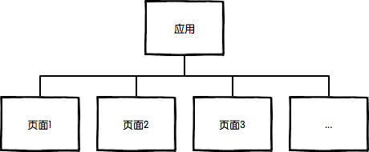
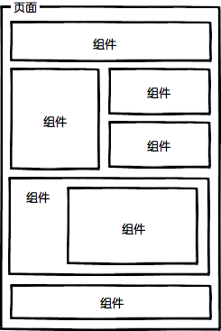

## 问题缘起
- **问题：** 如果bower用到了x.x.1的包a和x.x.2的包b,   如果包b自己也依赖包a且依赖的不是x.x.1版本的包a，这怎么解决？ 一个包只能装一个版本的……
- **回答：** 用sass就是这样，它的模块化系统支持指扁平化结构。组件化是可以的，但是不是origami的路子。react和vue都是把一个元素的html js 和css放在一块，构成一个完全独立的组件，就可以了。


## 学习资料
<https://github.com/fouber/blog/issues/10>

## 学习笔记

### 前端，是一种GUI软件
所有**Web应用**都是一种**运行在网页浏览器中的软件**，这些软件的**图形用户界面**（Graphical User Interface，简称GUI）即为前端。

### 前端工程的三个阶段
#### 1. 第一阶段：库/框架选型
##### 目的： 
提升**开发效率**。

##### 工具：
 jQuery/Bootstrap/React

#### 2. 第二阶段： 简单构建优化
##### 目的： 
提升**运行效率**。

##### 工具：
 grunt/gulp

##### 描述： 
选型一种构建工具，对代码进行**压缩**，**校验**，之后再以页面为单位进行简单的资源**合并**。

#### 3. 第三阶段： JS/CSS模块化开发
##### 目的：
提升**维护效率**

##### 工具
JS模块化:AMD/CommonJS/UMD/ES6 Module

CSS模块化： less、sass、stylus的import/mixin特性

##### 描述
**分而治之**是人家工程中的重要思想，是复杂系统开发和维护的基石。

模块化开发最大的意义是**分治**而非**复用**。***不管是否要复用某段代码，都应该将其分治为一个模块。***

#### 4. 第四阶段：组件化开发和工程管理
##### 背景
- 大体量：多功能、多页面、多状态、多系统；
- 大规模：多人甚至多团队合作开发；
- 高性能：CDN部署、缓存控制、文件指纹、缓存复用、请求合并、按需加载、同步/异步加载、移动端首屏CSS内嵌、HTTP 2.0服务端资源推送。

##### 目的
支撑多人合作开发和精细化性能优化


### 前端的小而美
前端，主要价值观历来是“小而美”。但工程方案也可以是“小而美”，**前端工程方案的“小而美”不是指代码量，而是指“规则”**。

#### 第一件事：组件化开发


##### 前端组件化开发理念解读：

- 页面上的每个 独立的 可视/可交互区域视为一个组件；
- 每个组件对应一个工程目录，组件所需的各种资源都在这个目录下**就近维护**；
- 由于组件具有独立性，因此组件与组件之间可以 自由组合；
- 页面只不过是组件的容器，负责组合组件形成功能完整的界面；
- 当不需要某个组件，或者想要替换组件时，可以整个目录删除/替换。

- 组件目录中包含该组件的所有内部逻辑：样式,JS,页面结构。

- 页面结构部分可以是静态的HTML文件，可以是前端模板，也可以是后端模板（如前端模板handlebars, .hbs文件；Rect的jsx；后端模板php；等）

##### 结合模块化开发，前端项目可以划分为这几种开发概念：

名称 | 说明 |	举例
---- |-----|------
JS模块|	独立的算法和数据单元|	浏览器环境检测(detect)，网络请求(ajax)，应用配置(config)，DOM操作(dom)，工具函数(utils)，以及组件里的JS单元
CSS模块|	独立的功能性样式单元|	栅格系统(grid)，字体图标(icon-fonts)，动画样式(animate)，以及组件里的CSS单元
UI组件|	独立的可视/可交互功能单元	页头(header)，页尾(footer)，导航栏(nav)，搜索框(search)
页面|	前端这种GUI软件的界面状态，是UI组件的容器|	首页(index)，列表页(list)，用户管理(user)
应用|	整个项目或整个站点被称之为应用，由多个页面组成

##### 前端开发工程结构
1. 整个Web应用由页面组成



2. 页面由组件组成



3. 一个组件一个目录


4. 组件可组合，组件的JS可依赖其他JS模块，CSS可依赖其他CSS单元


**综上，前端中小规模项目目录结构为：**


#### 第二件事：智能静态资源管理
##### 问题背景
模块化/组件化开发之后，我们**最终要解决的，就是模块/组件加载的技术问题**

前端与客户端GUI软件的最大不同：前端是一种**远程部署**、运行时**增量下载**的GUI软件。

根据“增量”的原则，我们应该**精心规划每个页面的资源加载策略**，使得用户无论访问哪个页面都能**按需加载**页面所需资源，没访问过的无需加载，访问过的可以缓存复用，最终带来流畅的应用体验。

**在基础架构中 贯彻增量原则 是第四阶段前端开发最迫切需要做好的**

##### 具体做法
Facebook的资源管理框架Celerity提供了资源加载接口，替代了传统的script/link等静态的资源加载标签，最终通过查表来加载资源。

> 静态资源管理系统 = 资源表 + 资源加载框架

1. **资源表**

**资源表**是一份数据文件(如json),是项目中所有静态资源（主要是JS和CSS）的构建信息记录，通过构建工具扫描项目源码生成，是一种k-v结构的数据，以每个资源的id为key，记录了资源的类别、部署路径、依赖关系、打包合并等内容，比如：

```
{
    "a.js": {
        "url": "/static/js/a.5f100fa.js",
        "dep": [ "b.js", "a.css" ]
    },
    "a.css": {
        "url": "/static/css/a.63cf374.css",
        "dep": [ "button.css" ]
    },
    "b.js": {
        "url": "/static/js/b.97193bf.js"
    },
    "button.css": {
        "url": "/static/css/button.de33108.css"
    }
}
```

另见2010年的Velocity China大会上，来自Facebook的David Wei博士展示的静态网页资源管理和优化技术,PPT已下载，详见***bigLearnMateria文件夹下VelocityChina2010Dec7StaticResource.pdf***。

2. **资源加载框架**
**源加载框架**则提供一些资源引用的API，让开发者根据id来引用资源，替代静态的script/link标签来收集、去重、按需加载资源。调用这些接口时，框架通过查表来查找资源的各项信息，并递归查找其依赖的资源的信息，然后我们可以在这个过程中实现各种性能优化算法来“智能”加载资源。<br>
根据业务场景的不同，加载框架可以在浏览器中用JS实现，也可以是后端模板引擎中用服务端语言实现，甚至二者的组合。
